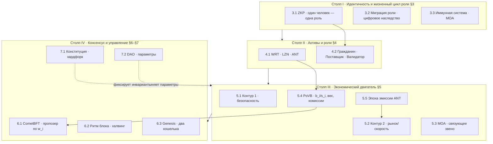

# Volnix Protocol — логическое деление по Whitepaper

Это деление системы на **концептуальные части**, опирающееся на нарратив
официального whitepaper (`docs/WHITEPAPER.md`, спецификация v4.20) — на его
**принципы и термины**, а не на структуру кода. Параллельный, код-ориентированный
разрез смотри в `docs/SYSTEM_LAYERS.md`.

> Здесь нет ссылок на `x/`-модули и файлы — только концепции whitepaper и §-разделы.
> §X.Y соответствуют разделам whitepaper.

---

## Идея верхнего уровня (§1–§2)

Whitepaper позиционирует систему как **цифровой социальный контракт** и добавляет
к трилемме (безопасность / децентрализация / масштабируемость) **четвёртую ось —
справедливость**. Опора — не анонимный капитал и не hash power, а **идентичность**
участников. Технический фундамент: **Proof-of-Verified-Burn (PoVB)** + **ZKP**,
неизменная монетарная политика, встроенный рынок без посредников.

Из этого вытекают **четыре концептуальных столпа**, на которые делится вся система:

---

## Столп I — Идентичность и жизненный цикл роли (§3)

**Концепт:** право участвовать в экономике привязано к **верифицированной
уникальной личности**, а не к капиталу.

### I.1 Сингулярная идентичность ZKP (§3.1)
- Правило **«один человек — одна верифицированная роль»**.
- ZKP доказывает уникальность без раскрытия данных, через **аккредитованных
  провайдеров**.
- При верификации — выбор **взаимоисключающей** роли: Поставщик **или** Валидатор.
- Защита от Сивиллы; ограничение слотов Поставщика (§7.2 п. 8).

### I.2 Миграция роли — «цифровое наследство» (§3.2)
- Восстановление роли после потери ключей через повторный ZKP.
- Переносятся **роль** и **учётные/замороженные активы** (активированный LZN,
  протокол-учтённый **ANT**) на новый кошелёк.
- **ANT переносит только протокол** (не пользовательский перевод).
- Ликвидные WRT и неактивированные LZN на утерянном кошельке — **недоступны**.

### I.3 Иммунная система — MOA как условие жизни роли (§3.3)
- Защита от «мёртвых» ролей; критерии **детерминированы**, не произвольны.
- При санкции: **сжигается весь ANT** роли; **LZN не конфискуются**;
  у Валидатора снимаются только права (консенсус + Контур 1).
- ZKP-идентификатор Поставщика освобождается (если была ZKP-привязка).

---

## Столп II — Активы и роли (§4)

**Концепт:** трёхкомпонентная экономика, где каждый актив и каждая роль имеют
**одну чёткую функцию** (разделение ответственности на уровне токеномики).

### II.1 Активы (§4.1)
| актив | функция (по whitepaper) | эмиссия | обращение |
|---|---|---|---|
| **WRT** (Wert) | ценность + **единственный** инструмент голоса DAO | фикс., Bitcoin-like, халвинг | свободное |
| **LZN** (Lizenz) | лицензия/мощность; задаёт потолок `b_i+s_i ≤ L_i`; сама по себе дохода **не даёт** | одноразовая | торгуемо; активация замораживает |
| **ANT** (Anteil) | топливо PoVB; **только** внутренний рынок + служебные движения; прямые переводы **запрещены** | эпохальная Поставщикам | order fills + emission/reset/burn/migration |

### II.2 Роли — типы кошельков (§4.2)
- **Гражданин (Тип 1):** не-верифицирован; WRT/LZN; ANT недоступен; точка входа.
- **Поставщик (Тип 2):** верифицирован; **продаёт ANT** за WRT; MOA `T_g`;
  ограничен лимитом активных слотов (§7.2 п. 8).
- **Валидатор (Тип 3):** верифицирован; активирует LZN (≤33%/кошелёк), **покупает
  и жжёт ANT**; объявляет `b_i`/`s_i`; вес `w_i=s_i/L_i`; MOA `T_v`.
- **Различение:** «гражданин DAO» (держатель WRT с голосом) ≠ роль кошелька
  «Гражданин»/«Поставщик».
- **Genesis-задел (§6.3):** 2 фиксированных адреса без ZKP, без «Супервизора».

---

## Столп III — Экономический двигатель: двухконтурная модель (§5)

**Концепт:** два независимых, но связанных контура на **внутреннем рынке**
(чейн-слой состояния + открытый клиент-кошелёк).

### III.1 Контур 1 — Безопасность и доход Валидаторов (§5.1)
- Базовая эмиссия WRT ∝ доле активированного LZN, **но только** среди тех,
  кто зафиксировал сжигание (`b_i > 0`).
- `b_i = 0` → доход 0 независимо от LZN: пассивное удержание исключено.

### III.2 Контур 2 — Производительность, рынок и доход Поставщиков (§5.2)
- **Предложение:** Поставщики выставляют sell-ANT ордера в течение эпохи.
- **Спрос:** Валидаторы покупают ANT, чтобы жечь на высоту.
- **Гибкие комиссии (Bitcoin-style):** ставку задаёт отправитель; рыночный сбор `F`.
- **Перераспределение:** fills → WRT Поставщикам; ANT Валидатор жжёт.

### III.3 MOA — связующее звено (§5.3)
- Единый критерий: **любая подписанная tx** в скользящем окне `T_g`/`T_v`.
- Привязывает статус Поставщика/Валидатора к **реальному присутствию**.
- Санкции: сжигание ANT роли; LZN остаются.

### III.4 PoVB — объявление участия: вес и комиссии (§5.4)
*(концептуальное ядро системы — и источник всех вопросов из `docs/CANON_PROBLEMS.md`)*
- Валидатор объявляет **два числа**: `b_i` (сжигание) и `s_i` (ставка), `b_i+s_i ≤ L_i`.
- На успешном блоке **оба сжигаются безвозвратно**.
- **Доход:** доля комиссий `F·(b_i/B)`, `B=Σb_i`; вес: `w_i=s_i/L_i`.
- **Глобальный лимит/порог:** `Σb_i ≤ λ·L_total` **и** `Σb_i ≥ λ·L_total`
  (genesis λ=1/3); отсев низковесов; потолок `K` подписантов (genesis 150).
- EndBlocker блока N формирует `ValidatorSet` для N+1.

### III.5 Эпоха эмиссии ANT (§5.5)
- Период в **технических блоках** `EpochBlocks` (эталон 10 080 ≈ «неделя»).
- **Шаг 1:** на границе эпохи **весь ANT Поставщиков сжигается** (баланс + эскроу).
- **Шаг 2:** новая эмиссия = `sold_prev × coefficient`, коэффициент в `[0.75, 1.5]`.
- Потолок: `ANT_max_epoch = EpochBlocks × L_total`. Валидаторский ANT — бессрочен.

---

## Столп IV — Консенсус и управление (§6–§7)

**Концепт:** стандартный CometBFT для порядка блоков + неизменное ядро токеномики
с **ограниченным** DAO поверх.

### IV.1 CometBFT: пропозер, вес, дележ комиссий (§6.1)
- Пропозер/консенсус — **стандарт CometBFT**, round-robin по весам.
- Вес `w_i = s_i/L_i` → доминирует **доля ставки**, не абсолютный LZN.
- Рынок не меняет консенсус; дележ комиссий — правило приложения.

### IV.2 Ритм блока и халвинг (§6.2)
- **Фиксированный** целевой интервал блока (Bitcoin-style «часы»).
- **Адаптивные таймауты** на высоту/раунд → средний интервал сходится к цели.
- Халвинг WRT каждые `HalvingInterval` блоков; периоды — в блоках, через DAO.

### IV.3 Genesis-блок (§6.3)
- Два фиксированных кошелька (Поставщик + Валидатор) без ZKP, без Супервизора.
- 10 000 LZN валидатору (1 активирован); 10 080 ANT поставщику.
- Со второго блока — штатный EndBlocker; со второй эпохи — формула от торгов.

### IV.4 Конституционный уровень — только хардфорк (§7.1)
Инварианты **вне голосования**: токеномика WRT/LZN, структура PoVB (два числа,
оба сжигаются, `b_i+s_i ≤ L_i`, лимит/порог λ, вес `s_i/L_i`, `b_i=0→0`),
консенсус по CometBFT, периоды в блоках, genesis, отсутствие жёсткого max supply ANT.

### IV.5 Законодательный уровень — параметры DAO (§7.2)
12 параметров с **min/max в коде** и тайм-локом: lock-up LZN; `T_g`/`T_v`;
лимит накопления ANT/эпоха; границы коэффициента эмиссии (0.75–1.5);
gas/блок; размер блока; лимит активных Поставщиков; `λ`; `K`;
`EpochBlocks`; `HalvingInterval`. Голосуют **держатели WRT**.

---

## Сводная таблица «концепт → раздел whitepaper → ключевые величины»

| Часть | § | Ключевые величины / термины |
|---|---|---|
| Идентичность ZKP | §3.1 | одна роль/личность; провайдеры |
| Миграция роли | §3.2 | перенос роли + учётных ANT/LZN протоколом |
| Иммунная система | §3.3, §5.3 | `T_g`, `T_v`; сжигание ANT, LZN остаются |
| Активы | §4.1 | WRT/LZN/ANT; `1 LZN = 1 ANT` |
| Роли | §4.2 | Гражданин/Поставщик/Валидатор; ≤33% LZN |
| Контур 1 | §5.1 | базовая награда WRT при `b_i>0` |
| Контур 2 | §5.2 | рынок ANT↔WRT; гибкие комиссии `F` |
| PoVB | §5.4 | `b_i`, `s_i`, `w_i=s_i/L_i`, `F·(b_i/B)`, `λ`, `K` |
| Эпоха ANT | §5.5 | `EpochBlocks`, coeff `[0.75,1.5]`, `ANT_max_epoch` |
| Консенсус | §6.1 | CometBFT round-robin по `w_i` |
| Ритм/халвинг | §6.2 | `BaseBlockTime`, `HalvingInterval` |
| Genesis | §6.3 | 2 кошелька, 10 000 LZN, 10 080 ANT |
| Конституция | §7.1 | инварианты вне голосования |
| DAO | §7.2 | 12 параметров, min/max, тайм-лок |

---

## Чем этот разрез отличается от `SYSTEM_LAYERS.md`

| | `WHITEPAPER_LAYERS.md` (этот) | `SYSTEM_LAYERS.md` |
|---|---|---|
| Основа | концепции whitepaper §1–§8 | реальный код `x/`, `app/`, `cmd/` |
| Деление | 4 концептуальных столпа | 5 технических слоёв + off-chain |
| Язык | принципы, активы, контуры | модули, Msg/Query, обвязка ноды |
| Аудитория | архитектурный/экономический обзор | разработчик ноды |
