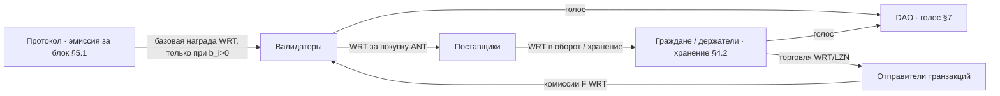

# Оборот WRT (Wert) — описание

Это выжимка из whitepaper (`docs/WHITEPAPER.md`, v4.20), посвящённая
**только обороту WRT**: откуда WRT берётся, как ходит между участниками,
на что тратится и почему его объём предсказуем. Описание дано «в нарративе»:
не списком формул, а рассказом о том, *из чего складывается жизнь WRT в сети*.

---

## Коротко: что такое WRT

WRT (Wert) — это **главный ценностный актив** сети и **единственный инструмент
голоса** в DAO (§4.1). Грубо говоря, всё, что в системе «стоит денег», измеряется
в WRT: им расплачиваются на внутреннем рынке, им награждают за безопасность сети,
и им же голосуют за параметры протокола. В отличие от ANT, WRT **свободно
обращается** — его можно держать и переводить обычным образом; это «настоящие
деньги» сети с фиксированной, биткоин-подобной эмиссией.

В двух словах оборот WRT — это **круг**: протокол **рождает** WRT как награду
валидаторам за блок, валидаторы **тратят** WRT на покупку ANT у Поставщиков,
Поставщики снова пускают WRT в дело, а часть WRT в виде комиссий **возвращается**
валидаторам за сам факт включения транзакций в блок. Поверх этого WRT даёт
**право голоса**.

---

## 1. Рождение WRT: эмиссия за блок (Контур 1, §5.1, §6.2)

Эмиссия заключается в том, что **на каждом блоке протокол начисляет базовую
награду в WRT** — это и есть способ, которым новый WRT появляется в системе
(аналог награды майнеру в Bitcoin). Но начисляется она не всем подряд:

- Награда делится **пропорционально доле активированного LZN** валидатора,
- **но только среди тех валидаторов, кто на этой высоте сжёг ANT** (`b_i > 0`).
- Если валидатор объявил `b_i = 0`, он не получает **ничего** из базовой эмиссии,
  сколько бы LZN у него ни было активировано (§5.1). Пассивное удержание лицензии
  дохода не приносит — нужно реальное участие через PoVB.

Объём этой эмиссии **уменьшается вдвое каждые `HalvingInterval` блоков** (халвинг
в духе Bitcoin, §6.2). Важно: интервал считается **в блоках**, а не в календарных
днях, и сам `HalvingInterval` — параметр, который держатели WRT утверждают через
DAO в рамках жёстких min/max в коде.

Итог по этому пункту: **новый WRT втекает в сеть только через блок и только к
активным валидаторам.** Это первый и единственный источник «свежего» WRT.

---

## 2. Комиссии: WRT за включение в блок (Контур 2, §5.2, §5.4)

Дальше — про комиссии, и это ровно тот сюжет «в блоке взимается комиссия, и это
подтверждается консенсусом». Логика такая:

- Комиссии в сети **гибкие, рыночные** (Bitcoin-style): отправитель **сам ставит
  цену** за свою транзакцию, а валидаторы/мемпул отдают приоритет тем, кто платит
  больше (§5.2). Никакой фиксированной протоколом надбавки нет — есть **плавающий
  рыночный сбор за блок-пространство** `F`.
- Когда блок собирается и подтверждается консенсусом CometBFT, **суммарные
  комиссии блока `F` делятся между валидаторами** — но не поровну, а
  **пропорционально сожжённому ANT**: доля валидатора `i` равна `F · (b_i / B)`,
  где `B = Σ b_i` по всем участникам (§5.4).
- Отсюда то же правило, что и с эмиссией: если `b_i = 0`, то и **доли комиссий
  валидатор не получает** (§5.4). Чтобы зарабатывать на комиссиях, нужно жечь ANT.

То есть консенсус здесь — это механизм, который не только упорядочивает
транзакции, но и **узаконивает дележ комиссий**: блок принят → комиссии `F`
собраны → разделены по `b_i/B`. Комиссия — это WRT, который **перетекает от
отправителей транзакций к валидаторам**.

---

## 3. Расчёты на внутреннем рынке: WRT ↔ ANT (Контур 2, §4.1, §5.2)

Главная «рабочая» точка оборота WRT — внутренний рынок, где WRT выступает
**валютой расчёта**:

- **Поставщики продают ANT за WRT.** В течение эпохи они выставляют sell-ордера
  на ANT (§5.2).
- **Валидаторы покупают этот ANT за WRT**, потому что ANT им нужен как топливо
  PoVB — его придётся сжечь на высоте (`b_i`/`s_i`, §5.4).
- При исполнении ордера (order fill) **WRT уходит Поставщику, а ANT — Валидатору**
  (§5.2 «Redistribution»: fills move WRT to Suppliers).

Так замыкается основной денежный круг: **валидатор получил WRT как награду/комиссию
→ отдал WRT Поставщику за ANT → сжёг ANT, чтобы снова заработать WRT.** WRT при
этом не уничтожается на рынке — он лишь **меняет владельца** (уничтожается ANT, а
не WRT).

Помимо ANT, на рынке за WRT торгуется и **LZN** (лицензии), так что WRT — это
универсальное средство расчёта для всех торгуемых активов сети (§4.1).

---

## 4. Право голоса: WRT как политический вес (§4.1, §7)

Отдельная грань оборота — не движение, а **обладание**: WRT является
**единственным инструментом голосования в DAO** (§7). «Избиратели DAO» — это
именно **держатели WRT**, которые участвуют в голосовании (вес и кворум — по
модулю управления). Важно не путать это с ролями кошелька (Гражданин/Поставщик):
право голоса даёт **сам факт владения WRT**, а не верифицированная роль (§4.1, §7).

Голосованием WRT-держатели меняют **законодательные параметры** (§7.2) — в т.ч.
`HalvingInterval`, `EpochBlocks`, `λ`, `K` и др., — но **не могут** трогать
конституционное ядро: общую эмиссию и график халвинга WRT, базовую монетарную
политику (§7.1). То есть сам **закон оборота WRT защищён от голосования** — DAO
крутит только периферийные ручки.

---

## 5. Где WRT «оседает»: Гражданин и хранение ценности (§4.2)

Наконец, конечная точка оборота — **хранение**. WRT свободно держат и торгуют им
кошельки всех типов, начиная с **Гражданина (Тип 1)** — неверифицированного
кошелька, который держит/торгует WRT и LZN, но **не имеет ANT** (§4.2). WRT —
это «store of value» сети: его можно просто хранить, в отличие от ANT, который
у Поставщиков **сгорает на границе эпохи** (§5.5), а у валидаторов сжигается на
каждом блоке.

---

## 6. Механизм создания блока: за что отвечает консенсус, за что — модули

Чтобы понять, *где именно* в блоке рождается и делится WRT, нужно развести две
вещи, которые часто смешивают: **консенсус** и **модули приложения**. Это разные
слои, и они отвечают за разное (§5 «CometBFT / Cosmos SDK fit», §6.1).

Если совсем коротко: **консенсус решает, *какой* блок и в *каком порядке*
транзакций будет принят, а модули решают, *что эти транзакции делают* с
состоянием** (балансами WRT/ANT/LZN, ролями, рынком). Консенсус ничего не знает
про экономику WRT — он только упорядочивает и подтверждает; вся логика денег
живёт в модулях.

### 6.1 Что делает консенсус (CometBFT)

Консенсус заключается в том, что узлы договариваются об **одном и том же блоке**:

- **Выбор пропозера.** На каждой высоте по round-robin выбирается валидатор-автор
  блока — **пропорционально весу `w_i = s_i / L_i`** (§6.1). Чем больше доля
  ставки, тем чаще узел становится пропозером. Ядро CometBFT при этом
  **стандартное**, не кастомизированное под Volnix.
- **Упорядочивание транзакций.** Пропозер набирает транзакции из мемпула и
  **фиксирует их порядок** в блоке. Приоритет — по комиссии (кто платит больше WRT,
  тот раньше включается, §5.2).
- **Голосование и финализация.** Узлы проходят раунды **PreVote → PreCommit** и,
  набрав **кворум ≥ 2/3** по весу, **коммитят** блок. Именно этот момент
  «подтверждается консенсусом»: блок принят всеми → его содержимое становится
  законом.
- **Ритм блока.** Консенсус держит **фиксированный целевой интервал** и
  детерминированно подстраивает таймауты раундов, чтобы средний интервал сходился
  к цели (§6.2).

Чего консенсус **не делает**: он не считает награды, не делит комиссии, не двигает
балансы и не знает, что такое WRT или ANT. Для него транзакция — просто
упорядоченные байты. Он гарантирует только **детерминированный порядок** и
**согласие** — а одинаковый порядок на всех узлах даёт одинаковый результат
исполнения.

### 6.2 Что делают модули приложения (фазы блока)

Когда консенсус договорился о блоке, **модули приложения исполняют** его в три
детерминированные фазы (порядок одинаков на всех узлах):

- **BeginBlock — начало блока.** Подготовительные действия на высоту:
  переключение фаз, служебные начисления, проверки перед исполнением транзакций.
- **DeliverTx — исполнение каждой транзакции по порядку.** Здесь оживает то, что
  упорядочил консенсус:
  - переводы WRT, торговые ордера и их **детерминированное сведение** (matching)
    на внутреннем рынке — при фиксированном порядке транзакций результат
    одинаков на всех узлах (§5);
  - объявление участия `MsgDeclareParticipation{b_i, s_i}` от валидаторов (§5.4);
  - смена ролей, ZKP-верификация, активация LZN и т.п.
- **EndBlock — завершение блока (ключевая фаза для WRT).** Здесь модули считают
  всю экономику (§5.4, §5.1, §5.5):
  - **сжигают** объявленные `b_i + s_i` у валидаторов;
  - **начисляют базовую эмиссию WRT** активным валидаторам (`b_i>0`)
    пропорционально доле LZN (Контур 1);
  - **делят комиссии блока** `F` по правилу `F·(b_i/B)`;
  - применяют глобальный лимит/порог `λ` и потолок `K`, **отсекают низковесов**
    и **формируют `ValidatorSet` для блока N+1** (возвращают его консенсусу);
  - проверяют **MOA** (`T_g`/`T_v`) и при нарушении снимают роли / жгут ANT;
  - на границе эпохи выполняют **сброс и новую эмиссию ANT** Поставщикам (§5.5).

### 6.3 Где в этой картине WRT

Сводя к обороту WRT из разделов 1–5:

| Этап блока | Слой | Что происходит с WRT |
|---|---|---|
| Выбор пропозера, порядок tx | **консенсус** | приоритет включения по размеру комиссии (WRT), но движения денег ещё нет |
| PreVote/PreCommit, commit | **консенсус** | блок узаконивается — это и есть «подтверждено консенсусом» |
| DeliverTx | **модули** | переводы WRT, исполнение ордеров (WRT ↔ ANT) |
| EndBlock | **модули** | **эмиссия** WRT валидаторам и **дележ комиссий** `F·(b_i/B)` |

Итог: **консенсус создаёт и подтверждает блок** (порядок + согласие), а **модули
наполняют этот блок экономическим смыслом** — именно в `EndBlock` рождается новый
WRT и делятся комиссии. Один невозможен без другого: без консенсуса не было бы
согласованного блока, а без модулей блок был бы пустой последовательностью
байтов без движения WRT.

## 7. Прочие механизмы (кроме консенсуса и модулей), затрагивающие WRT

Консенсус и модули — это два главных слоя, но между «пользователь нажал отправить»
и «WRT поменял владельца в блоке» работает ещё несколько вспомогательных
механизмов. Они не придумывают экономику WRT, но **без них WRT не сдвинется**.
Ниже — только те, что реально касаются оборота WRT, простыми словами.

### 7.1 Кошелёк и подпись транзакции (клиентский слой)
WRT **не двигается сам по себе** — любое движение начинается с **подписанной
транзакции**. Пользователь через клиент (эталонный — **Volnix wallet**, §5)
формирует транзакцию (например «купить ANT за 10 WRT» или «перевести WRT») и
**подписывает её своим ключом**. Без валидной подписи сеть транзакцию не примет.
Здесь же отправитель **указывает комиссию** в WRT, которую готов заплатить
(см. раздел 2). По сути это «входная дверь» для любого оборота WRT.

### 7.2 Мемпул — «зал ожидания» транзакций
Подписанная транзакция сначала попадает не в блок, а в **мемпул** — временную
очередь ещё не подтверждённых транзакций на узлах. Это место, где **живёт
рыночек комиссий**: чем больше WRT-комиссию ты поставил, тем выше приоритет, и
тем скорее пропозер возьмёт твою транзакцию в блок (§5.2). Если комиссия низкая,
транзакция может «ждать» дольше. То есть размер WRT-комиссии влияет на оборот ещё
**до** попадания в блок.

### 7.3 Сеть / распространение (P2P-госсип)
Узлы соединены в сеть и **пересылают транзакции друг другу** (госсип), чтобы твоя
транзакция дошла до того узла, который сейчас собирает блок (пропозера). С точки
зрения WRT это означает простую вещь: между «отправил» и «включилось в блок» есть
**задержка распространения** по сети. (В нашей off-chain симуляции этот слой
моделируется отдельно — `NetworkSim`, см. `docs/SYSTEM_LAYERS.md`.)

### 7.4 Проверка и списание комиссии (привратник перед исполнением)
Перед тем как модули исполнят транзакцию, есть «привратник», который **проверяет
подпись и сразу резервирует/списывает WRT-комиссию** и базовые условия (хватает
ли средств, корректен ли формат). Если комиссии не хватает или подпись неверна —
транзакция **отклоняется и до экономики дело не доходит**. Только пройдя этого
привратника, транзакция попадает в исполнение (DeliverTx, раздел 6.2). Это
гарантирует, что **за место в блоке всегда платят WRT**.

### 7.5 Хранилище состояния (где «лежат» балансы WRT)
Все балансы WRT (и роли, и ордера) хранятся в **состоянии сети** — это
детерминированная база данных, одинаковая на всех узлах. Когда модуль в блоке
начисляет награду или переводит WRT, он **меняет запись в этом хранилище**.
Именно поэтому после коммита блока баланс «настоящий» и одинаковый у всех:
оборот WRT — это, технически, согласованное изменение этого общего хранилища.

### 7.6 Genesis — стартовый «розлив» (одноразово)
Особый механизм — **genesis**, начальное состояние сети в самом первом блоке
(§6.3). Это не повторяющийся процесс, а **разовый старт**: именно здесь
закладывается начальная раздача активов (в т.ч. кому что принадлежит на момент
запуска). Для WRT genesis задаёт **точку отсчёта** оборота — дальше WRT рождается
уже только через эмиссию за блок (раздел 1).

### Как это укладывается в путь одной WRT-транзакции

```
кошелёк подписал (7.1)
   → мемпул, приоритет по комиссии (7.2)
      → госсип донёс до пропозера (7.3)
         → консенсус упорядочил и подтвердил блок (раздел 6.1)
            → привратник списал WRT-комиссию, проверил подпись (7.4)
               → модули исполнили: перевод/ордер, эмиссия, дележ F (раздел 6.2)
                  → новое состояние записано, балансы WRT обновлены (7.5)
```

Итог: **консенсус** и **модули** — это «мозг» оборота WRT, а механизмы 7.1–7.6 —
это «руки и нервы»: кошелёк создаёт движение, мемпул и сеть его доставляют,
привратник берёт WRT-комиссию, хранилище фиксирует результат, а genesis всё это
однажды запустил.

---

## Схема оборота WRT



---

## Сводка: пять граней оборота WRT

| Грань | Что происходит | § |
|---|---|---|
| **Эмиссия** | Новый WRT рождается как награда за блок активным валидаторам (`b_i>0`), халвинг каждые `HalvingInterval` блоков | §5.1, §6.2 |
| **Комиссии** | Рыночный сбор `F` собирается в блоке и делится по `F·(b_i/B)` | §5.2, §5.4 |
| **Рынок** | WRT — валюта расчёта; валидаторы платят WRT Поставщикам за ANT (и за LZN) | §4.1, §5.2 |
| **Голос** | WRT — единственный инструмент голосования DAO | §4.1, §7 |
| **Хранение** | Свободное обращение и store-of-value; держат все, включая Граждан | §4.2 |

**Главное:** WRT — единственный *свободно обращающийся* и *эмитируемый* токен
сети. Он **рождается** только в блоке (эмиссия + комиссии валидаторам),
**циркулирует** через рынок (валидаторы → Поставщики → держатели), и **наделяет
голосом**. ANT при этом — топливо, которое сгорает; LZN — лицензия-потолок;
а WRT — те самые «деньги», ради движения которых работает вся экономика.
