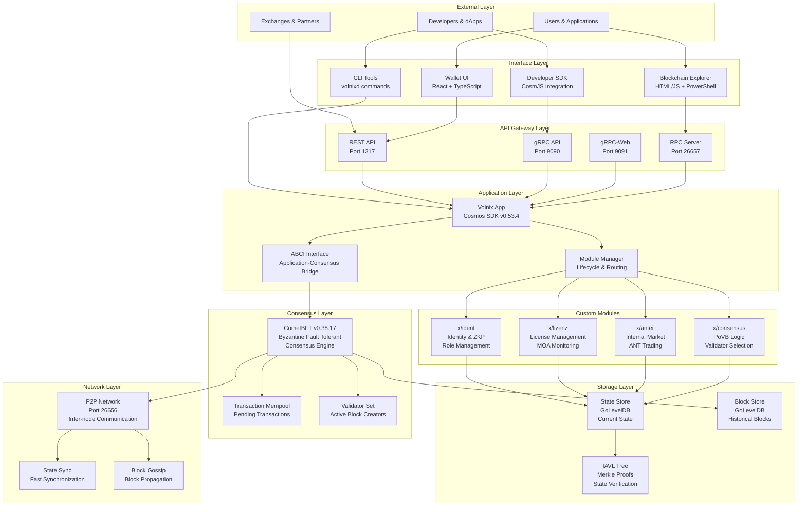
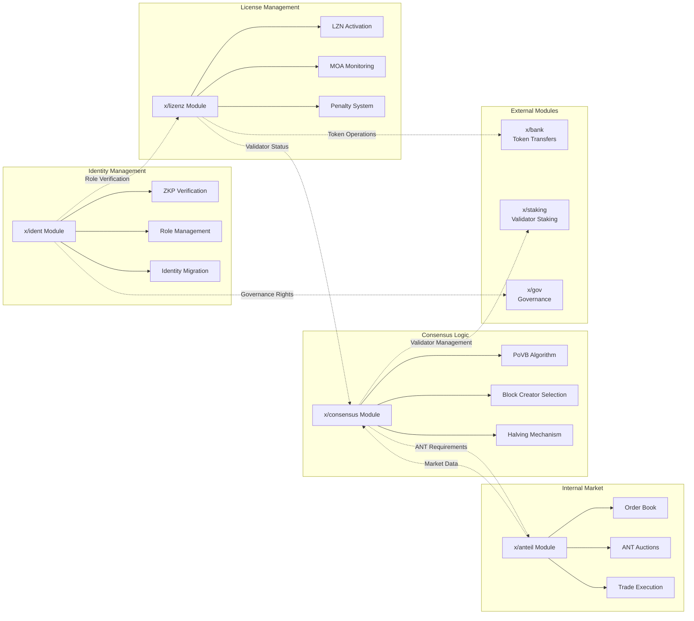
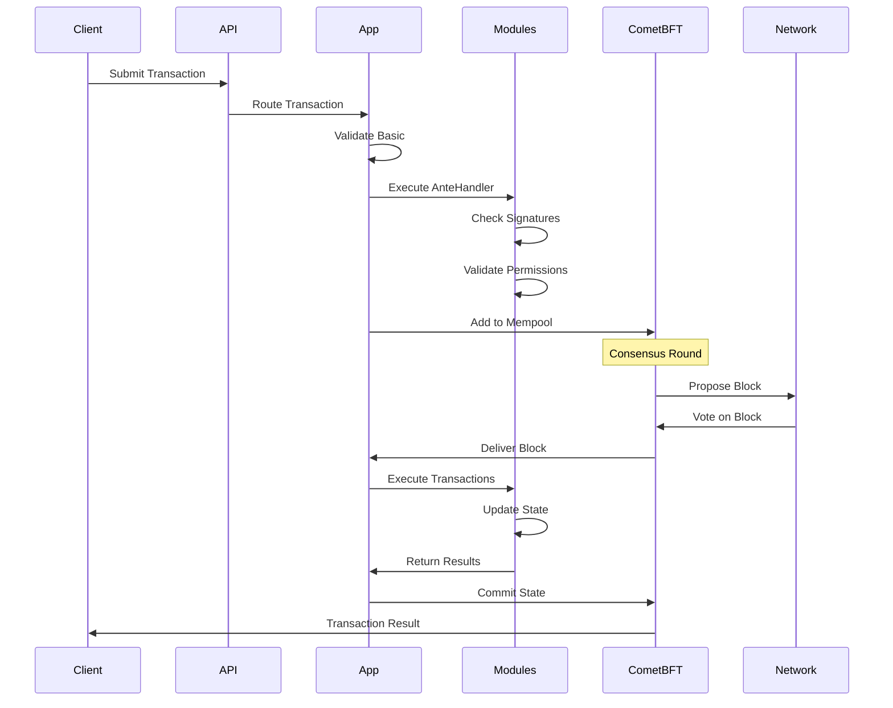
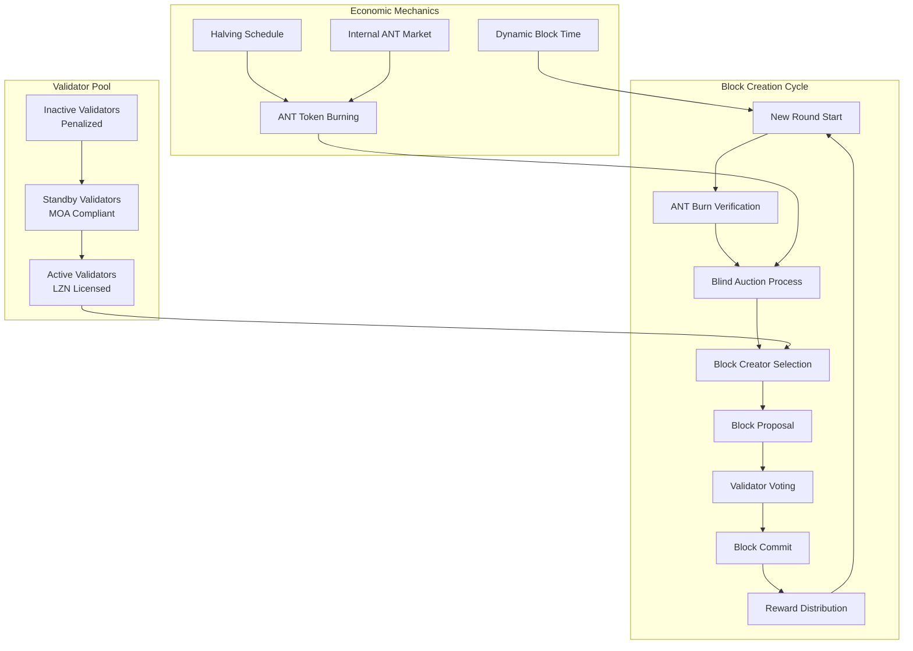
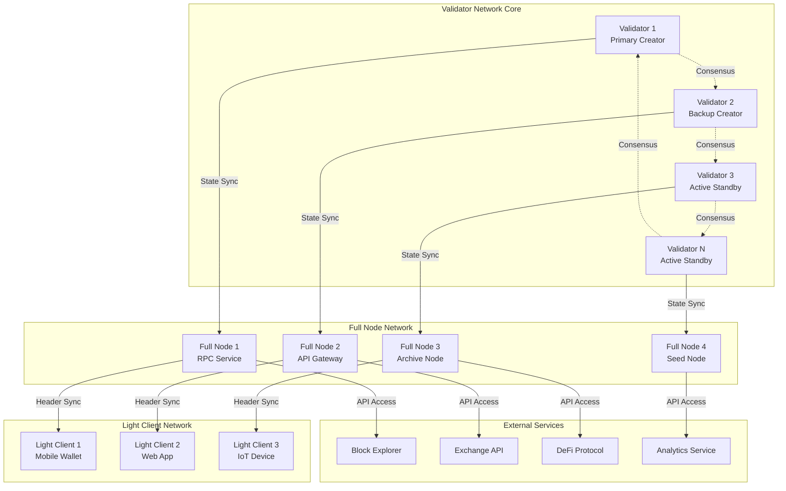
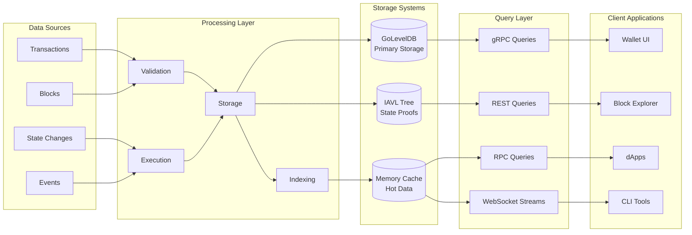
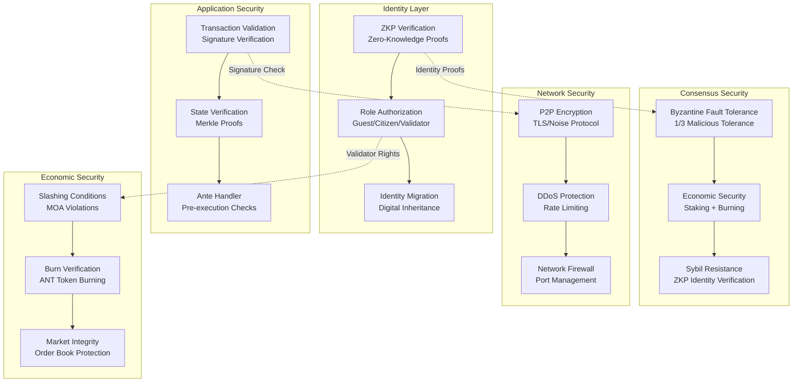
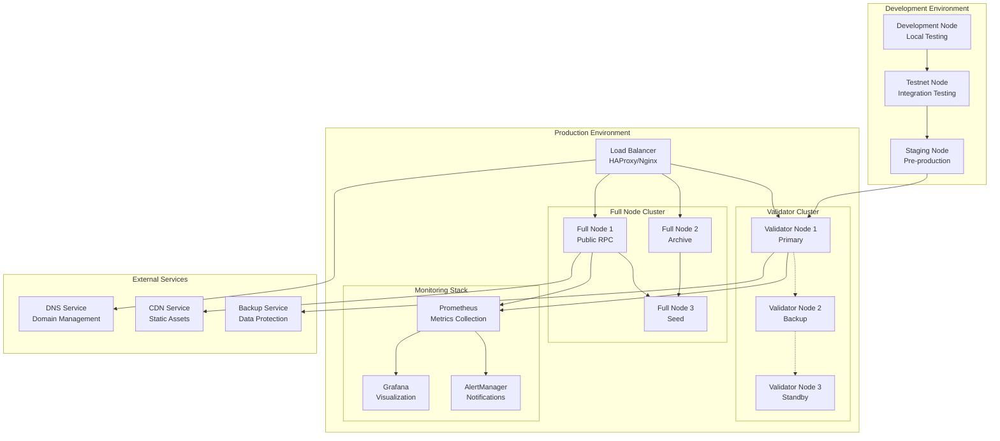

# Volnix Protocol - Architecture Diagrams

This document contains detailed architectural diagrams for the Volnix Protocol infrastructure.

## 1. System Architecture Overview

## 2. Module Interaction Diagram

## 3. Transaction Processing Pipeline

## 4. PoVB Consensus Flow

## 5. Network Topology

## 6. Data Flow Architecture

## 7. Security Architecture

## 8. Deployment Architecture

---

*These diagrams provide visual representations of the Volnix Protocol architecture at different levels of detail. They complement the system overview documentation and serve as reference materials for developers, operators, and stakeholders.*