# Core Architecture - Volnix Protocol

## Обзор

Данный документ описывает базовую архитектуру блокчейна Volnix Protocol, построенного на Cosmos SDK с интеграцией CometBFT. Архитектура следует многоуровневой модели, обеспечивающей четкое разделение ответственности между компонентами консенсуса, приложения и сети.

## Многоуровневая архитектура

Volnix Protocol построен по принципу многоуровневой архитектуры, где каждый уровень имеет четко определенные обязанности и интерфейсы взаимодействия:

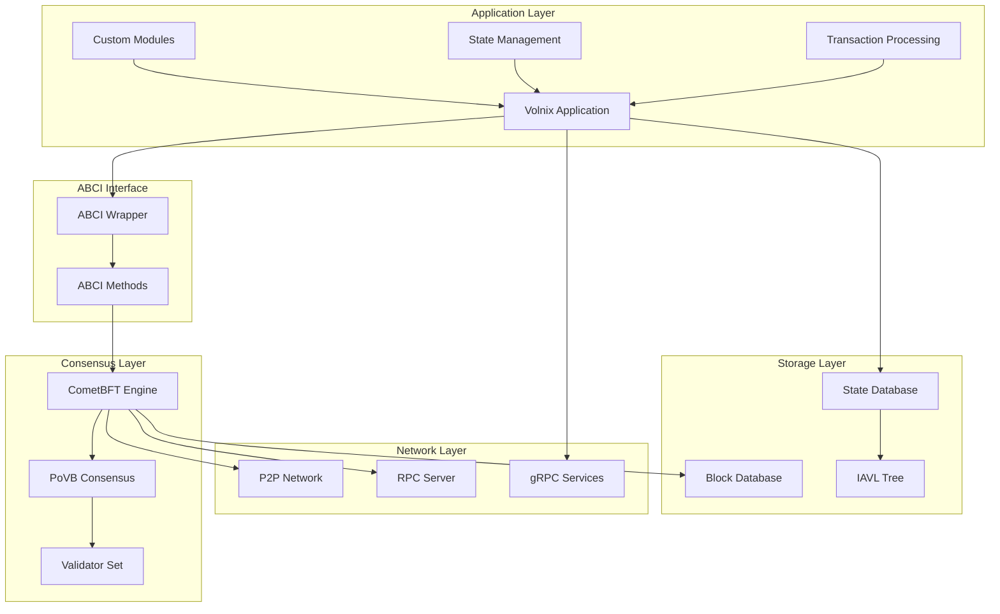

### 1. Application Layer (Уровень приложения)

Уровень приложения содержит бизнес-логику блокчейна Volnix Protocol и построен на базе Cosmos SDK.

#### Основные компоненты:

**Volnix Application (`app/app.go`)**
- Центральный компонент, координирующий работу всех модулей
- Управляет жизненным циклом приложения (инициализация, обработка блоков, завершение)
- Обеспечивает маршрутизацию транзакций к соответствующим модулям
- Управляет состоянием приложения и его персистентностью

**Custom Modules (Кастомные модули)**
- `x/ident`: Управление идентичностью и ZKP верификация
- `x/lizenz`: Управление лицензиями LZN и MOA мониторинг
- `x/anteil`: Внутренний рынок ANT и аукционная система
- `x/consensus`: Логика консенсуса PoVB и управление валидаторами

**State Management (Управление состоянием)**
- Координация изменений состояния между модулями
- Обеспечение ACID свойств для операций с состоянием
- Управление версионированием состояния для rollback операций

**Transaction Processing (Обработка транзакций)**
- Валидация транзакций на уровне приложения
- Выполнение бизнес-логики транзакций
- Обновление состояния приложения

### 2. ABCI Interface (Интерфейс ABCI)

Application Blockchain Interface (ABCI) обеспечивает связь между уровнем приложения и консенсус-движком CometBFT.

#### ABCI Wrapper (`app/abci_wrapper.go`)

Обертка, адаптирующая методы Volnix Application к интерфейсу ABCI:

```go
type ABCIWrapper struct {
    *MinimalVolnixApp
}

// Основные ABCI методы
func (w *ABCIWrapper) CheckTx(ctx context.Context, req *abci.RequestCheckTx) (*abci.ResponseCheckTx, error)
func (w *ABCIWrapper) FinalizeBlock(ctx context.Context, req *abci.RequestFinalizeBlock) (*abci.ResponseFinalizeBlock, error)
func (w *ABCIWrapper) Commit(ctx context.Context, req *abci.RequestCommit) (*abci.ResponseCommit, error)
func (w *ABCIWrapper) Query(ctx context.Context, req *abci.RequestQuery) (*abci.ResponseQuery, error)
```

#### Ключевые ABCI методы:

**InitChain**
- Инициализация блокчейна с genesis состоянием
- Настройка начальных параметров консенсуса
- Создание начального набора валидаторов

**CheckTx**
- Предварительная валидация транзакций в mempool
- Проверка подписей и базовых правил
- Фильтрация недействительных транзакций

**FinalizeBlock**
- Окончательная обработка транзакций в блоке
- Выполнение бизнес-логики и обновление состояния
- Генерация событий и результатов выполнения

**Commit**
- Фиксация изменений состояния в базе данных
- Вычисление нового хеша состояния (AppHash)
- Подготовка к следующему блоку

### 3. Consensus Layer (Уровень консенсуса)

Уровень консенсуса обеспечивает согласованность состояния сети и безопасность блокчейна.

#### CometBFT Engine

CometBFT (ранее Tendermint) служит консенсус-движком для Volnix Protocol:

**Основные функции:**
- Byzantine Fault Tolerant консенсус
- Управление жизненным циклом блоков
- Синхронизация состояния между узлами
- Обработка голосований валидаторов

**Интеграция с PoVB:**
- Адаптация алгоритма выбора создателя блока
- Интеграция механизма сжигания ANT
- Поддержка динамического времени блока

#### Validator Set Management

Управление набором валидаторов осуществляется через модуль `x/consensus`:

```go
type ValidatorInfo struct {
    Address     string
    PubKey      crypto.PubKey
    VotingPower int64
    LizenzStake uint64
    IsActive    bool
}
```

### 4. Network Layer (Сетевой уровень)

Сетевой уровень обеспечивает коммуникацию между узлами и внешними клиентами.

#### P2P Network

Peer-to-peer сеть на базе CometBFT обеспечивает:
- Обнаружение и подключение к пирам
- Распространение блоков и транзакций
- Синхронизацию состояния сети
- Защиту от сетевых атак

#### RPC Services

**Tendermint RPC (порт 26657)**
- Базовые операции с блокчейном
- Отправка транзакций
- Запросы состояния сети
- WebSocket подписки на события

**gRPC Services (порт 9090)**
- Высокопроизводительные API для модулей
- Типизированные запросы и ответы
- Поддержка streaming операций

**REST API (порт 1317)**
- HTTP-совместимые эндпоинты
- Автогенерация из gRPC схем
- Поддержка OpenAPI спецификаций

## Интеграция с Cosmos SDK

Volnix Protocol построен на Cosmos SDK v0.53.4, используя следующие ключевые компоненты:

### BaseApp

BaseApp служит основой для Volnix Application:

```go
type VolnixApp struct {
    *baseapp.BaseApp
    
    appCodec codec.Codec
    
    // Store keys для модулей
    keyIdent     *storetypes.KVStoreKey
    keyLizenz    *storetypes.KVStoreKey
    keyAnteil    *storetypes.KVStoreKey
    keyConsensus *storetypes.KVStoreKey
    
    // Keepers для модулей
    identKeeper     *identkeeper.Keeper
    lizenzKeeper    *lizenzkeeper.Keeper
    anteilKeeper    *anteilkeeper.Keeper
    consensusKeeper *consensuskeeper.Keeper
    
    // Module manager
    mm *module.Manager
}
```

### Module Manager

Module Manager координирует работу всех модулей:

**Инициализация модулей:**
```go
mm := module.NewManager(
    ident.NewAppModule(identKeeper),
    lizenz.NewAppModule(lizenzKeeper),
    anteil.NewAppModule(anteilKeeper),
    consensus.NewConsensusAppModule(encoding.Codec, *consensusKeeper),
)
```

**Регистрация сервисов:**
```go
configurator := module.NewConfigurator(encoding.Codec, bapp.MsgServiceRouter(), bapp.GRPCQueryRouter())
mm.RegisterServices(configurator)
```

### Store Management

Каждый модуль имеет собственное хранилище:

```go
// Создание store keys
keyIdent := storetypes.NewKVStoreKey(identtypes.StoreKey)
keyLizenz := storetypes.NewKVStoreKey(lizenztypes.StoreKey)
keyAnteil := storetypes.NewKVStoreKey(anteiltypes.StoreKey)
keyConsensus := storetypes.NewKVStoreKey(consensustypes.StoreKey)

// Монтирование хранилищ
bapp.MountKVStores(map[string]*storetypes.KVStoreKey{
    identtypes.StoreKey:     keyIdent,
    lizenztypes.StoreKey:    keyLizenz,
    anteiltypes.StoreKey:    keyAnteil,
    consensustypes.StoreKey: keyConsensus,
})
```

## Интеграция с CometBFT

### Server Architecture

Volnix Server интегрирует приложение с CometBFT узлом:

```go
type VolnixServer struct {
    app       *MinimalVolnixApp
    node      *node.Node
    config    *cmtcfg.Config
    homeDir   string
    logger    log.Logger
    cmtLogger cmtlog.Logger
}
```

### Node Creation

Создание CometBFT узла с ABCI приложением:

```go
func (s *VolnixServer) createCometBFTNode() error {
    // Загрузка ключей узла
    nodeKey, err := p2p.LoadOrGenNodeKey(nodeKeyFile)
    
    // Создание приватного валидатора
    privValidator := privval.LoadOrGenFilePV(privValKeyFile, privValStateFile)
    
    // ABCI клиент
    abciWrapper := NewABCIWrapper(s.app)
    clientCreator := proxy.NewLocalClientCreator(abciWrapper)
    
    // Создание узла
    s.node, err = node.NewNode(
        s.config,
        privValidator,
        nodeKey,
        clientCreator,
        genesisProvider,
        dbProvider,
        metricsProvider,
        s.cmtLogger,
    )
    
    return err
}
```

### Genesis Configuration

Конфигурация genesis файла для CometBFT:

```go
genDoc := &types.GenesisDoc{
    GenesisTime:     time.Now(),
    ChainID:         "test-volnix",
    InitialHeight:   1,
    ConsensusParams: types.DefaultConsensusParams(),
    AppState: []byte(`{
        "ident": {"params": {}, "verified_accounts": []},
        "lizenz": {"params": {}, "lizenzs": []},
        "anteil": {"params": {}, "orders": [], "auctions": []},
        "consensus": {"params": {}, "consensus_state": {}}
    }`),
}
```

## ABCI Interface и Transaction Processing Pipeline

### ABCI Methods Flow

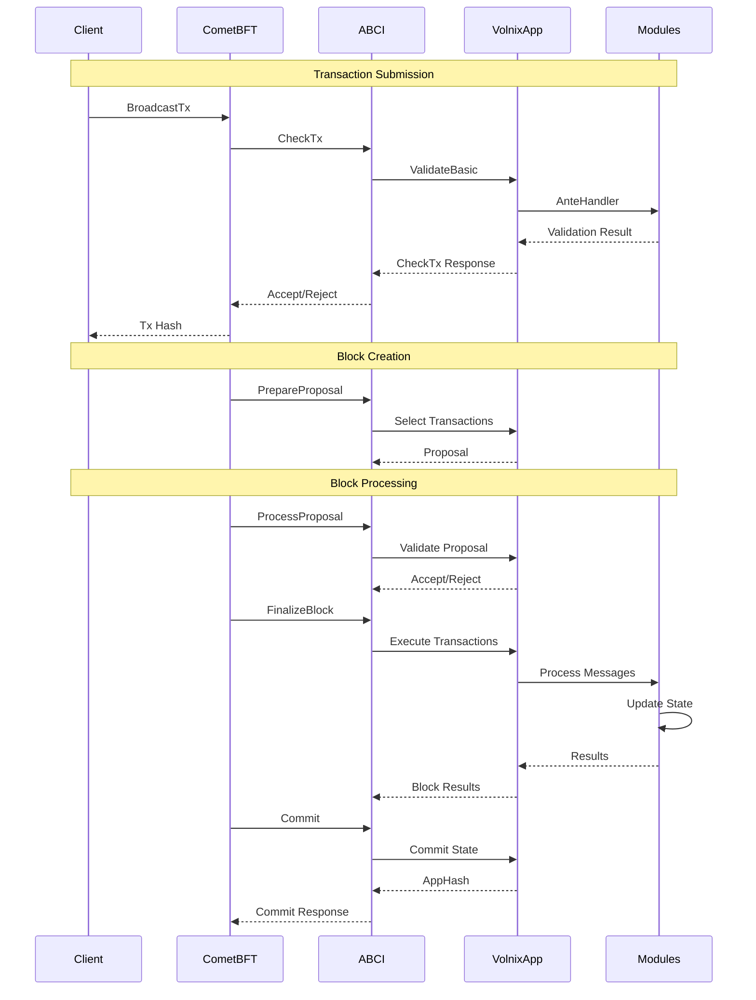

### Transaction Processing Pipeline

#### 1. Transaction Validation (CheckTx)

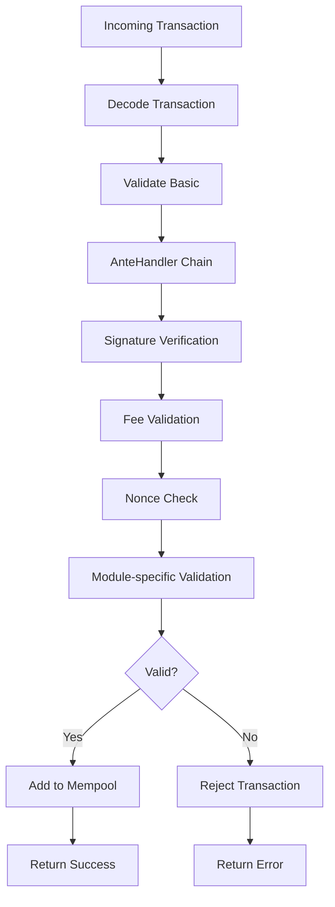

**AnteHandler Chain:**
```go
func MinimalAnteHandler(ctx sdk.Context, tx sdk.Tx, simulate bool) (sdk.Context, error) {
    // Базовая проверка подписей
    if len(tx.GetMsgs()) == 0 {
        return ctx, fmt.Errorf("transaction must contain at least one message")
    }
    
    // Проверка подписей (упрощенная версия)
    for _, msg := range tx.GetMsgs() {
        if err := msg.ValidateBasic(); err != nil {
            return ctx, err
        }
    }
    
    return ctx, nil
}
```

#### 2. Block Proposal (PrepareProposal)

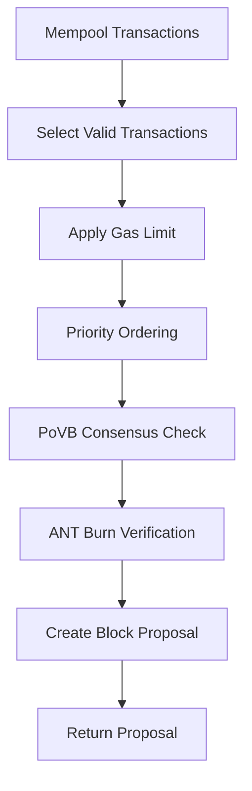

#### 3. Block Processing (FinalizeBlock)

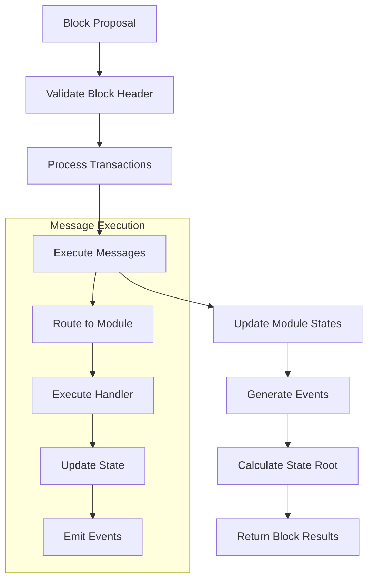

#### 4. State Commitment (Commit)

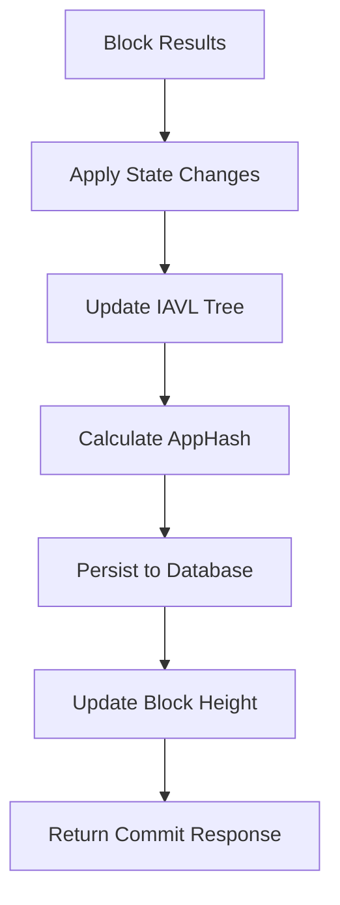

## Диаграммы последовательности для ключевых операций

### 1. Identity Verification Process

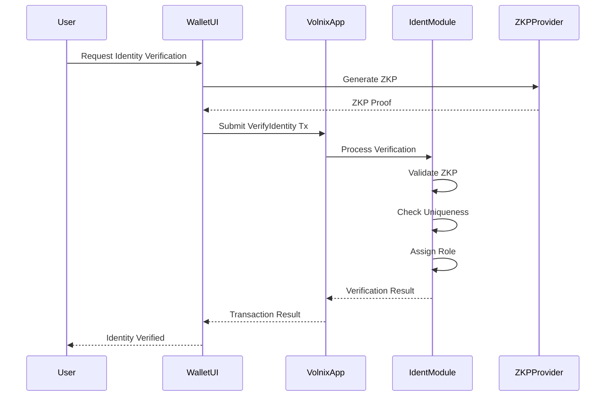

### 2. LZN License Activation

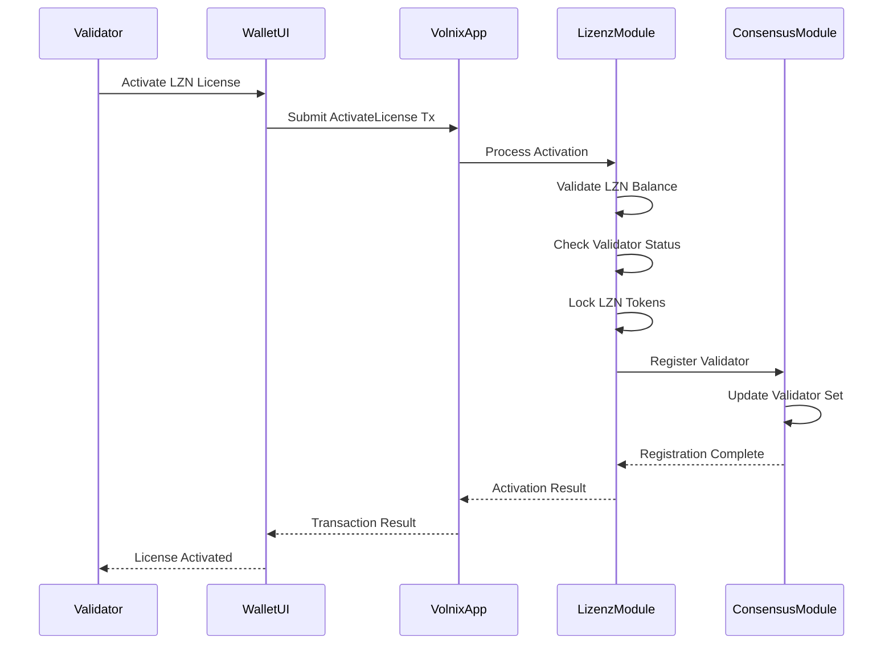

### 3. ANT Market Trading

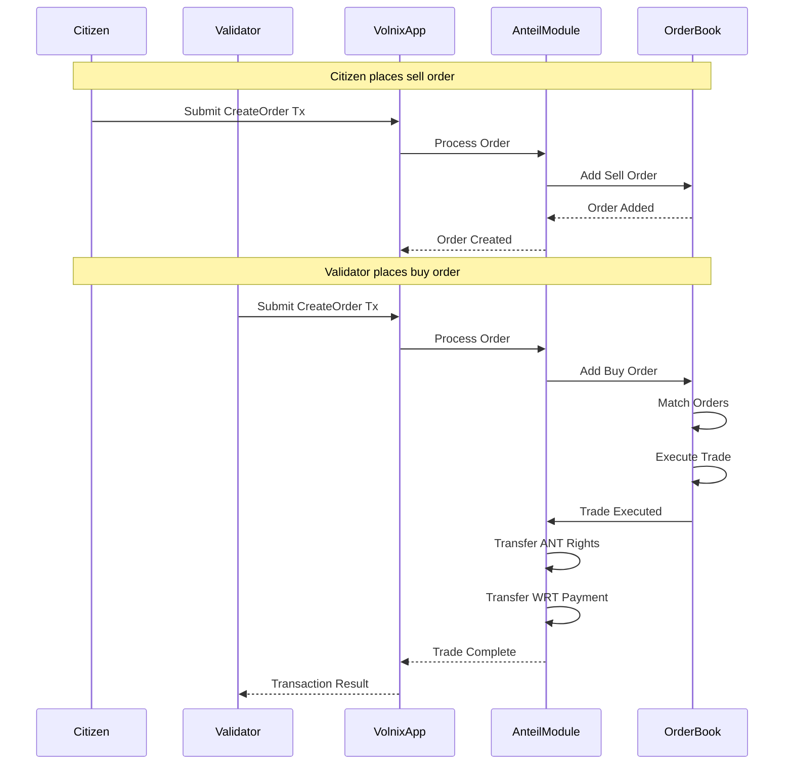

### 4. PoVB Block Creation Process

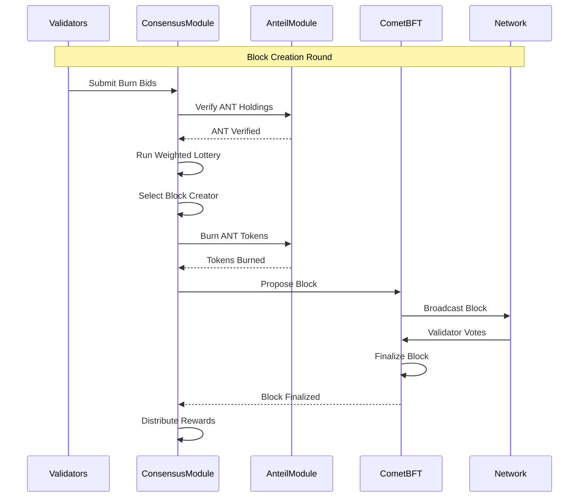

### 5. MOA Compliance Check

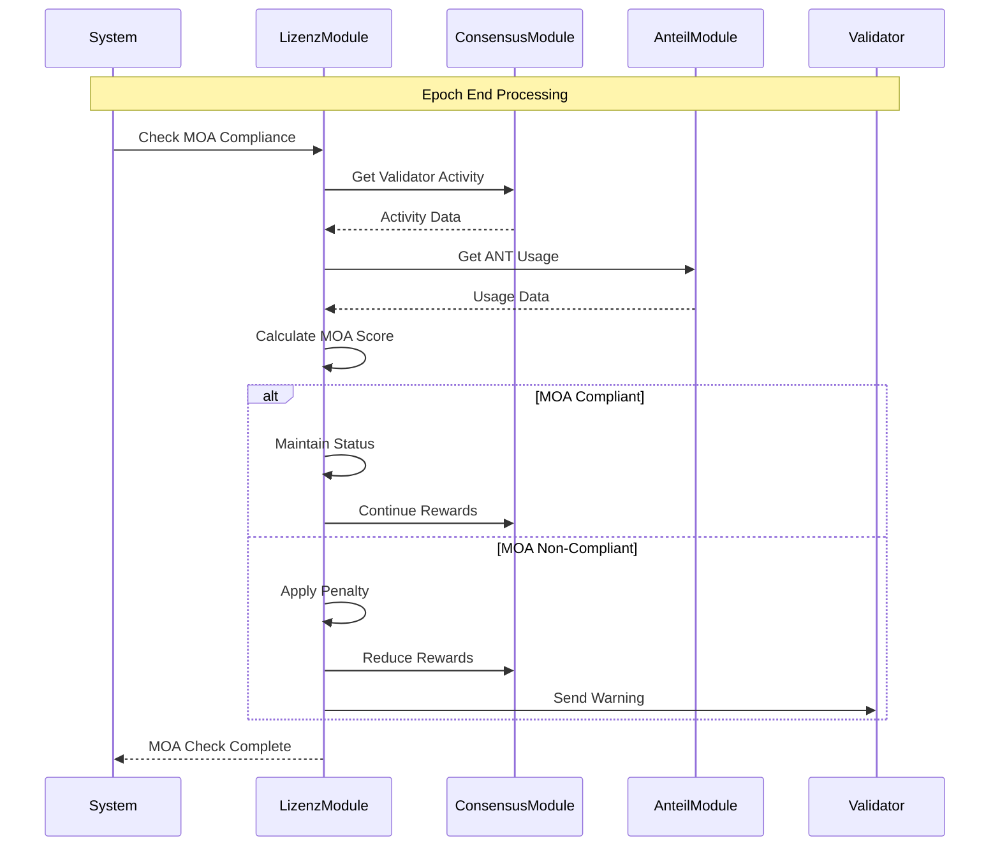

## Module Architecture Details

### Identity Module (x/ident)

**Основные функции:**
- ZKP верификация уникальности пользователей
- Управление ролями (Guest, Citizen, Validator)
- Механизм миграции ролей при потере ключей
- Мониторинг активности и автоматическая деактивация

**Ключевые структуры данных:**
```go
type VerifiedAccount struct {
    Address    string
    Role       RoleType
    ZKPHash    string
    VerifiedAt time.Time
    LastActive time.Time
}

type RoleType int32
const (
    ROLE_GUEST     RoleType = 0
    ROLE_CITIZEN   RoleType = 1
    ROLE_VALIDATOR RoleType = 2
)
```

### License Module (x/lizenz)

**Основные функции:**
- Активация и деактивация LZN лицензий
- Мониторинг MOA (Minimum Obligation Activity)
- Управление валидаторскими правами
- Система штрафов за нарушения

**Ключевые структуры данных:**
```go
type LizenzInfo struct {
    Owner        string
    Amount       uint64
    ActivatedAt  time.Time
    IsActive     bool
    MOAScore     uint64
    LastActivity time.Time
}
```

### Anteil Module (x/anteil)

**Основные функции:**
- Управление внутренним рынком ANT
- Обработка ордеров и аукционов
- Распределение прав на производительность
- Учет позиций пользователей

**Ключевые структуры данных:**
```go
type Order struct {
    ID        uint64
    Creator   string
    OrderType OrderType
    Amount    uint64
    Price     uint64
    Status    OrderStatus
}

type UserPosition struct {
    Address    string
    ANTRights  uint64
    LockedANT  uint64
    LastUpdate time.Time
}
```

### Consensus Module (x/consensus)

**Основные функции:**
- Реализация логики PoVB консенсуса
- Управление набором валидаторов
- Обработка процесса сжигания ANT
- Распределение наград

**Ключевые структуры данных:**
```go
type ConsensusState struct {
    CurrentEpoch    uint64
    BlockCreator    string
    TotalBurned     uint64
    ValidatorWeights map[string]uint64
}

type BurnProof struct {
    Validator string
    Amount    uint64
    Signature []byte
    Timestamp time.Time
}
```

## Storage Layer Architecture

### State Management

Volnix Protocol использует многоуровневую систему хранения:

**IAVL Tree (Immutable AVL Tree)**
- Криптографически верифицируемое дерево состояний
- Поддержка исторических запросов
- Эффективные доказательства включения

**GoLevelDB Backend**
- Высокопроизводительное key-value хранилище
- Поддержка транзакций и снапшотов
- Оптимизация для SSD накопителей

**Store Keys и Prefixes**
```go
// Store keys для модулей
const (
    IdentStoreKey     = "ident"
    LizenzStoreKey    = "lizenz"
    AnteilStoreKey    = "anteil"
    ConsensusStoreKey = "consensus"
)

// Prefixes для разных типов данных
var (
    VerifiedAccountPrefix = []byte{0x01}
    LizenzInfoPrefix      = []byte{0x02}
    OrderPrefix           = []byte{0x03}
    ValidatorPrefix       = []byte{0x04}
)
```

### Data Persistence

**State Commitment Process:**
1. Транзакции изменяют состояние в памяти
2. В конце блока изменения применяются к IAVL дереву
3. Вычисляется новый корневой хеш (AppHash)
4. Состояние сохраняется в базу данных
5. Старые версии состояния могут быть удалены (pruning)

## Performance Characteristics

### Throughput Metrics

| Метрика | Текущее значение | Целевое значение |
|---------|------------------|------------------|
| **Transactions per Second** | 5,000 | 10,000+ |
| **Block Processing Time** | <100ms | <50ms |
| **State Commitment Time** | <200ms | <100ms |
| **Memory Usage** | 2GB | 1GB |

### Optimization Strategies

**Transaction Processing:**
- Параллельная валидация транзакций
- Кэширование результатов проверки подписей
- Оптимизация сериализации/десериализации

**State Management:**
- Lazy loading состояния модулей
- Batch операции для обновления состояния
- Эффективное использование кэша

**Network Communication:**
- Сжатие сетевых сообщений
- Пулинг соединений для gRPC
- Оптимизация P2P протокола

## Security Considerations

### Consensus Security

**Byzantine Fault Tolerance:**
- Поддержка до 1/3 злонамеренных валидаторов
- Криптографическая верификация всех сообщений
- Защита от long-range атак через checkpointing

**Economic Security:**
- Стейкинг LZN токенов создает экономические стимулы
- Механизм slashing за нарушения протокола
- Сжигание ANT предотвращает спам-атаки

### Application Security

**Input Validation:**
- Строгая валидация всех входящих данных
- Проверка границ для числовых значений
- Санитизация строковых параметров

**State Integrity:**
- Криптографические доказательства состояния
- Атомарность операций на уровне блока
- Защита от race conditions

**Access Control:**
- Роль-основанная система доступа
- ZKP верификация для критических операций
- Временные ограничения для привилегированных действий

## Monitoring and Observability

### Metrics Collection

**Prometheus Metrics:**
```go
var (
    BlockHeight = prometheus.NewGauge(prometheus.GaugeOpts{
        Name: "volnix_block_height",
        Help: "Current block height",
    })
    
    TransactionCount = prometheus.NewCounter(prometheus.CounterOpts{
        Name: "volnix_transactions_total",
        Help: "Total number of transactions processed",
    })
    
    ValidatorCount = prometheus.NewGauge(prometheus.GaugeOpts{
        Name: "volnix_validators_active",
        Help: "Number of active validators",
    })
)
```

**Health Checks:**
- Проверка состояния консенсуса
- Мониторинг синхронизации с сетью
- Контроль использования ресурсов
- Проверка доступности API эндпоинтов

### Logging Strategy

**Structured Logging:**
```go
logger.Info("Block processed",
    "height", blockHeight,
    "txs", len(block.Txs),
    "time", processingTime,
    "validator", blockCreator,
)
```

**Log Levels:**
- **ERROR**: Критические ошибки, требующие вмешательства
- **WARN**: Потенциальные проблемы, требующие внимания
- **INFO**: Важные события в жизненном цикле
- **DEBUG**: Детальная информация для отладки

## Заключение

Архитектура Volnix Protocol обеспечивает:

1. **Модульность**: Четкое разделение ответственности между компонентами
2. **Масштабируемость**: Возможность горизонтального и вертикального масштабирования
3. **Безопасность**: Многоуровневая система защиты от различных типов атак
4. **Производительность**: Оптимизация для высокой пропускной способности
5. **Наблюдаемость**: Комплексный мониторинг и логирование

Данная архитектура создает прочную основу для развития экосистемы Volnix Protocol и обеспечивает долгосрочную устойчивость системы.