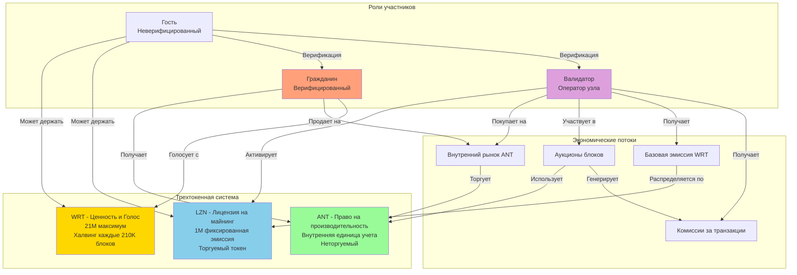
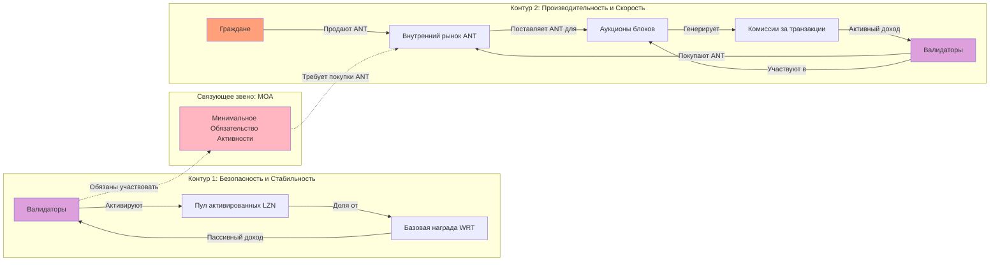
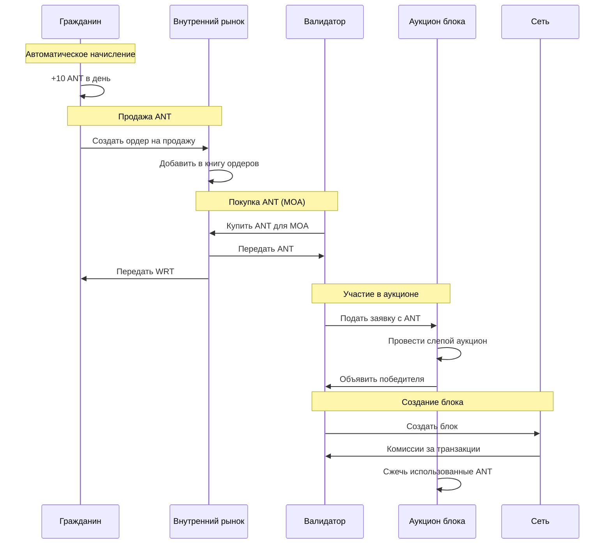
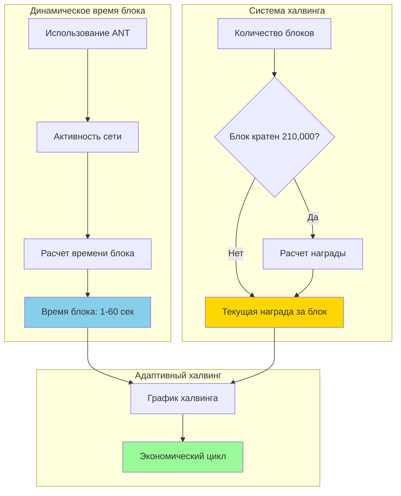
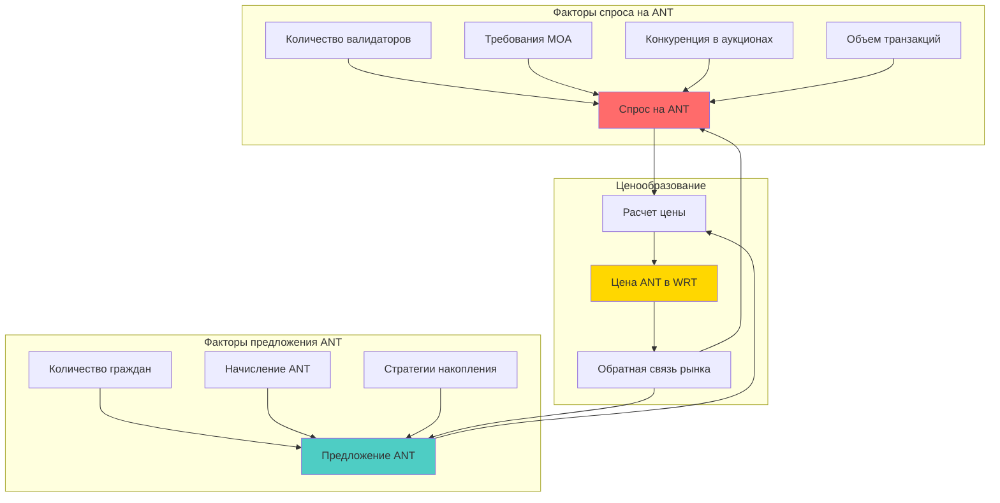
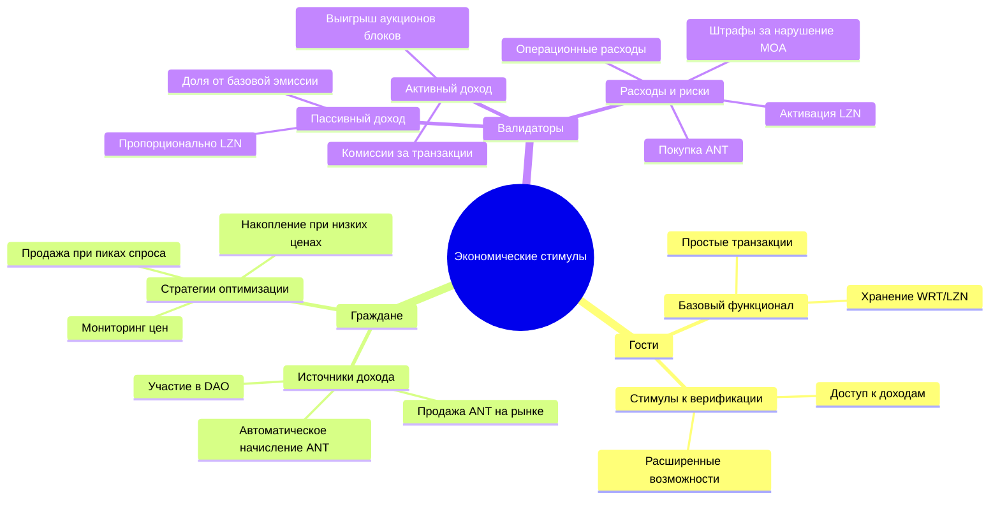
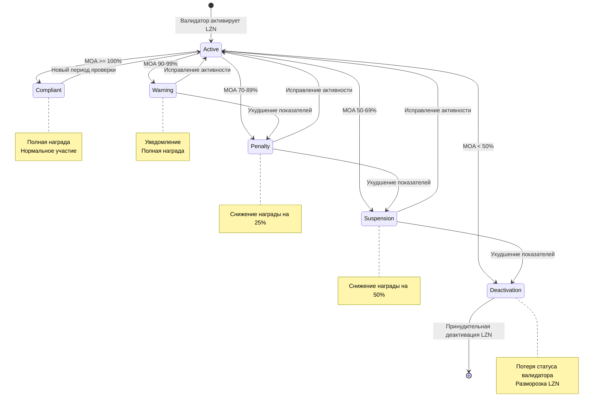
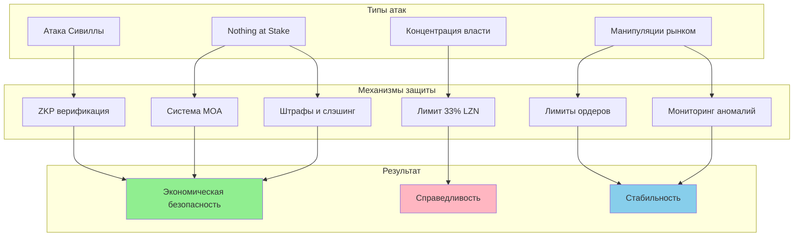

# Диаграммы экономической модели Volnix Protocol

## Схема взаимодействия токенов

## Двухконтурная экономическая модель

## Поток создания и использования ANT

## Механизм халвинга и динамического времени блока

## Модель ценообразования на внутреннем рынке

## Экономические стимулы по ролям

## Система мониторинга MOA

## Защита от экономических атак

