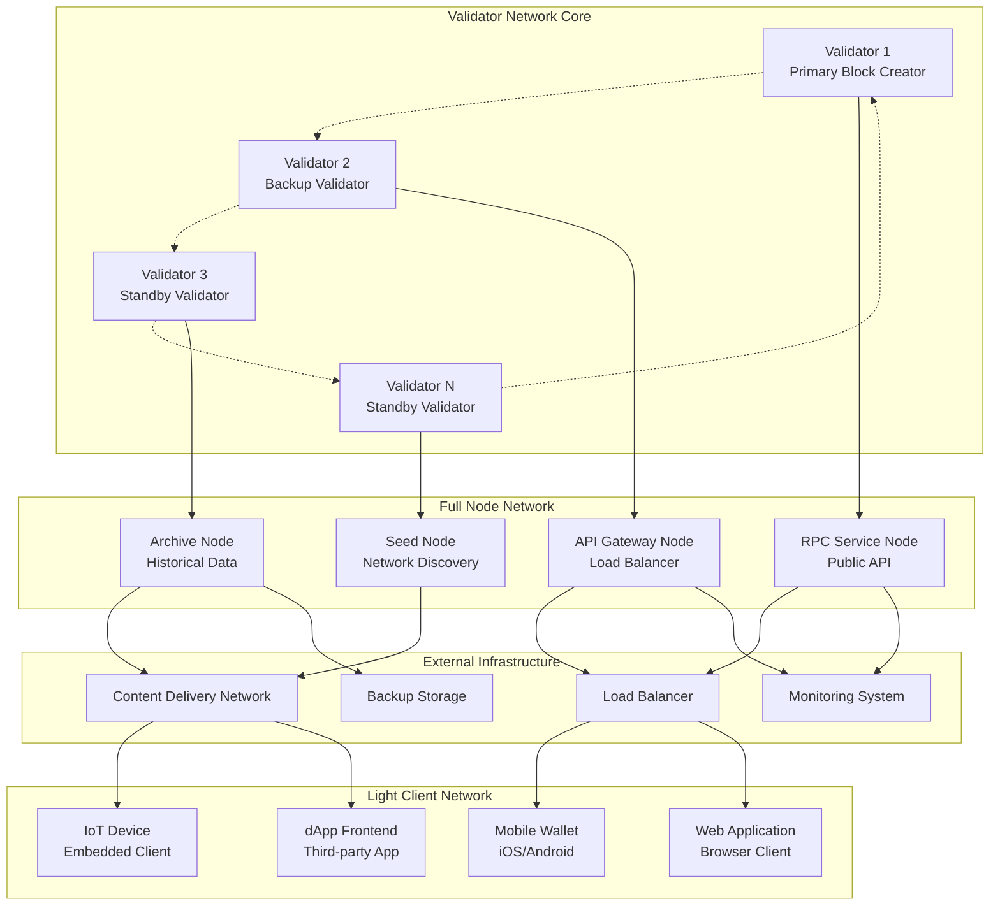
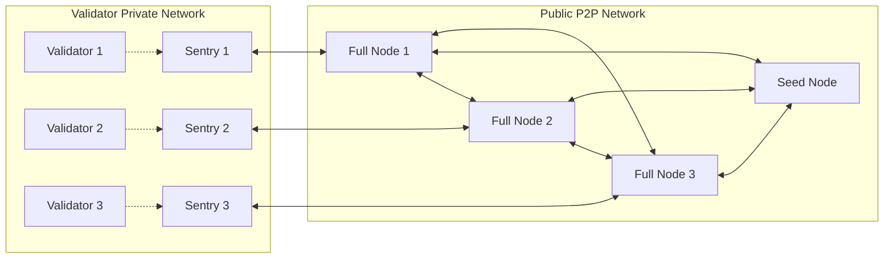
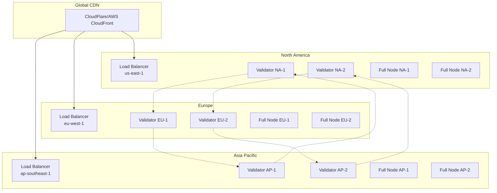

# Network Infrastructure Guide

## Обзор

Данное руководство описывает сетевую инфраструктуру Volnix Protocol - суверенного блокчейна первого уровня, построенного на базе Cosmos SDK с консенсусом Proof-of-Verified-Burn (PoVB). Документ охватывает архитектуру сети, конфигурацию узлов, безопасность и рекомендации по развертыванию.

## Архитектура сети

### Топология сети

Volnix Protocol использует многоуровневую архитектуру сети, обеспечивающую масштабируемость, безопасность и отказоустойчивость:



### Типы узлов

#### 1. Validator Nodes (Узлы валидаторов)
- **Назначение**: Создание блоков и участие в консенсусе PoVB
- **Требования**: 
  - LZN лицензия на майнинг
  - Активированная роль Validator через модуль x/ident
  - Соблюдение MOA (Minimum Obligation Activity)
  - Достаточное количество ANT токенов для участия в аукционах
- **Характеристики**:
  - Высокая доступность (99.9%+)
  - Низкая задержка сети (<50ms)
  - Защищенное хранение приватных ключей
  - Мониторинг производительности в реальном времени

#### 2. Full Nodes (Полные узлы)
- **Назначение**: Синхронизация полного состояния блокчейна и предоставление API
- **Типы**:
  - **RPC Service Nodes**: Обслуживание публичных API запросов
  - **API Gateway Nodes**: Балансировка нагрузки и кэширование
  - **Archive Nodes**: Хранение полной истории блокчейна
  - **Seed Nodes**: Обнаружение пиров и начальная синхронизация
- **Характеристики**:
  - Полная синхронизация состояния
  - Валидация всех транзакций и блоков
  - Предоставление gRPC, REST и WebSocket API
  - Поддержка исторических запросов

#### 3. Light Clients (Легкие клиенты)
- **Назначение**: Минимальная синхронизация для мобильных и веб-приложений
- **Характеристики**:
  - Синхронизация только заголовков блоков
  - Верификация через Merkle доказательства
  - Минимальные требования к ресурсам
  - Поддержка offline режима

#### 4. Sentry Nodes (Узлы-стражи)
- **Назначение**: Защита валидаторов от DDoS атак и сетевых угроз
- **Характеристики**:
  - Фильтрация входящих соединений
  - Скрытие IP адресов валидаторов
  - Распределение нагрузки
  - Защита от спам-атак

## P2P протоколы и сетевая архитектура

### CometBFT P2P Network

Volnix Protocol использует P2P сеть CometBFT для межузлового взаимодействия:

#### Основные протоколы:
- **Block Sync Protocol**: Синхронизация блоков между узлами
- **State Sync Protocol**: Быстрая синхронизация состояния для новых узлов
- **Consensus Protocol**: Обмен сообщениями консенсуса (prevote, precommit)
- **Mempool Protocol**: Распространение транзакций в сети
- **Evidence Protocol**: Обмен доказательствами злонамеренного поведения

#### Сетевая топология:


### Peer Discovery и Connection Management

#### Механизмы обнаружения пиров:
1. **Seed Nodes**: Начальные узлы для подключения к сети
2. **Persistent Peers**: Постоянные соединения с доверенными узлами
3. **Address Book**: Локальная база данных известных пиров
4. **PEX (Peer Exchange)**: Обмен адресами пиров между узлами

#### Конфигурация соединений:
```toml
# P2P Configuration
[p2p]
# Адрес для входящих P2P соединений
laddr = "tcp://0.0.0.0:26656"

# Внешний адрес для анонсирования другим пирам
external_address = ""

# Seed узлы для начального подключения
seeds = "seed1.volnix.network:26656,seed2.volnix.network:26656"

# Постоянные пиры (всегда поддерживать соединение)
persistent_peers = ""

# Максимальное количество входящих соединений
max_num_inbound_peers = 40

# Максимальное количество исходящих соединений
max_num_outbound_peers = 10

# Строгая проверка адресной книги
addr_book_strict = false

# Время ожидания handshake
handshake_timeout = "20s"

# Время ожидания dial
dial_timeout = "3s"
```

## Эндпоинты и порты системы

### Стандартные порты Volnix Protocol

| Сервис | Порт | Протокол | Назначение | Доступ |
|--------|------|----------|------------|--------|
| **P2P Network** | 26656 | TCP | Межузловое взаимодействие | Публичный |
| **RPC Server** | 26657 | HTTP/WebSocket | API запросов и транзакций | Ограниченный |
| **ABCI Application** | 26658 | TCP | Интерфейс приложения | Локальный |
| **gRPC Server** | 9090 | gRPC | Высокопроизводительный API | Ограниченный |
| **gRPC-Web** | 9091 | HTTP | gRPC совместимый с браузерами | Публичный |
| **REST API** | 1317 | HTTP | RESTful API эндпоинты | Публичный |
| **Prometheus Metrics** | 26660 | HTTP | Метрики мониторинга | Локальный |
| **Application Monitoring** | 8080 | HTTP | Мониторинг приложения | Локальный |

### Детальное описание эндпоинтов

#### RPC Server (порт 26657)
Основной API для взаимодействия с блокчейном:

**HTTP эндпоинты:**
- `GET /status` - Статус узла и сети
- `GET /health` - Проверка работоспособности
- `GET /block` - Информация о блоке
- `GET /blockchain` - Диапазон блоков
- `GET /validators` - Список валидаторов
- `GET /consensus_state` - Состояние консенсуса
- `POST /broadcast_tx_sync` - Синхронная отправка транзакции
- `POST /broadcast_tx_async` - Асинхронная отправка транзакции
- `POST /broadcast_tx_commit` - Отправка с ожиданием включения в блок

**WebSocket эндпоинты:**
- `ws://localhost:26657/websocket` - Подписка на события
- События: `NewBlock`, `NewBlockHeader`, `Tx`, `ValidatorSetUpdates`

#### gRPC Server (порт 9090)
Высокопроизводительный API для модулей:

**Сервисы модулей:**
- `volnix.ident.v1.Query` - Запросы модуля Identity
- `volnix.lizenz.v1.Query` - Запросы модуля Lizenz
- `volnix.anteil.v1.Query` - Запросы модуля Anteil
- `volnix.consensus.v1.Query` - Запросы модуля Consensus

**Стандартные Cosmos SDK сервисы:**
- `cosmos.auth.v1beta1.Query` - Аутентификация
- `cosmos.bank.v1beta1.Query` - Банковские операции
- `cosmos.tx.v1beta1.Service` - Транзакции

#### REST API (порт 1317)
HTTP-совместимые эндпоинты, автогенерируемые из gRPC:

**Базовые эндпоинты:**
- `GET /cosmos/auth/v1beta1/accounts/{address}` - Информация об аккаунте
- `GET /cosmos/bank/v1beta1/balances/{address}` - Балансы токенов
- `POST /cosmos/tx/v1beta1/txs` - Отправка транзакции

**Кастомные модули:**
- `GET /volnix/ident/v1/verified_accounts` - Верифицированные аккаунты
- `GET /volnix/lizenz/v1/lizenzs` - Активные лицензии
- `GET /volnix/anteil/v1/orders` - Ордера внутреннего рынка
- `GET /volnix/consensus/v1/validators` - Валидаторы PoVB

## Конфигурации firewall и сетевой безопасности

### Базовая конфигурация firewall

#### Linux (UFW)
```bash
# Базовая настройка
sudo ufw --force reset
sudo ufw default deny incoming
sudo ufw default allow outgoing

# SSH доступ (измените порт при необходимости)
sudo ufw allow 22/tcp

# P2P сеть (обязательно для всех узлов)
sudo ufw allow 26656/tcp

# RPC API (только для публичных узлов)
sudo ufw allow 26657/tcp

# REST API (только для публичных узлов)
sudo ufw allow 1317/tcp

# gRPC-Web (только для публичных узлов)
sudo ufw allow 9091/tcp

# Мониторинг (только для внутренней сети)
sudo ufw allow from 10.0.0.0/8 to any port 8080
sudo ufw allow from 172.16.0.0/12 to any port 8080
sudo ufw allow from 192.168.0.0/16 to any port 8080

# Активация firewall
sudo ufw --force enable
```

#### Windows (PowerShell)
```powershell
# P2P сеть
New-NetFirewallRule -DisplayName "Volnix P2P" -Direction Inbound -Protocol TCP -LocalPort 26656 -Action Allow

# RPC API (опционально)
New-NetFirewallRule -DisplayName "Volnix RPC" -Direction Inbound -Protocol TCP -LocalPort 26657 -Action Allow

# REST API (опционально)
New-NetFirewallRule -DisplayName "Volnix REST" -Direction Inbound -Protocol TCP -LocalPort 1317 -Action Allow

# gRPC-Web (опционально)
New-NetFirewallRule -DisplayName "Volnix gRPC-Web" -Direction Inbound -Protocol TCP -LocalPort 9091 -Action Allow

# Мониторинг (только локально)
New-NetFirewallRule -DisplayName "Volnix Monitoring" -Direction Inbound -Protocol TCP -LocalPort 8080 -LocalAddress 127.0.0.1 -Action Allow
```

### Продвинутая конфигурация безопасности

#### Iptables правила для валидаторов
```bash
#!/bin/bash
# Скрипт настройки firewall для валидатора

# Очистка существующих правил
iptables -F
iptables -X
iptables -t nat -F
iptables -t nat -X

# Политики по умолчанию
iptables -P INPUT DROP
iptables -P FORWARD DROP
iptables -P OUTPUT ACCEPT

# Loopback интерфейс
iptables -A INPUT -i lo -j ACCEPT

# Установленные соединения
iptables -A INPUT -m state --state ESTABLISHED,RELATED -j ACCEPT

# SSH (измените порт)
iptables -A INPUT -p tcp --dport 22 -j ACCEPT

# P2P только от доверенных sentry узлов
iptables -A INPUT -p tcp --dport 26656 -s 10.0.1.10 -j ACCEPT
iptables -A INPUT -p tcp --dport 26656 -s 10.0.1.11 -j ACCEPT
iptables -A INPUT -p tcp --dport 26656 -s 10.0.1.12 -j ACCEPT

# Мониторинг только из внутренней сети
iptables -A INPUT -p tcp --dport 8080 -s 10.0.0.0/8 -j ACCEPT

# Блокировка всего остального
iptables -A INPUT -j DROP

# Сохранение правил
iptables-save > /etc/iptables/rules.v4
```

#### DDoS защита
```bash
# Ограничение количества соединений
iptables -A INPUT -p tcp --dport 26656 -m connlimit --connlimit-above 50 -j DROP

# Ограничение частоты новых соединений
iptables -A INPUT -p tcp --dport 26656 -m recent --set --name P2P
iptables -A INPUT -p tcp --dport 26656 -m recent --update --seconds 60 --hitcount 20 --name P2P -j DROP

# Защита от SYN flood
iptables -A INPUT -p tcp --syn -m limit --limit 1/s --limit-burst 3 -j ACCEPT
iptables -A INPUT -p tcp --syn -j DROP
```

### Сетевая сегментация

#### Архитектура с DMZ
```
Internet
    │
    ▼
┌─────────────────┐
│   Load Balancer │ (Public IPs)
│   (HAProxy/Nginx)│
└─────────────────┘
    │
    ▼
┌─────────────────┐
│      DMZ        │ (10.0.1.0/24)
│  ┌───────────┐  │
│  │Sentry Node│  │
│  │    1-3    │  │
│  └───────────┘  │
└─────────────────┘
    │
    ▼
┌─────────────────┐
│ Private Network │ (10.0.2.0/24)
│  ┌───────────┐  │
│  │Validator  │  │
│  │  Nodes    │  │
│  └───────────┘  │
└─────────────────┘
    │
    ▼
┌─────────────────┐
│ Management Net  │ (10.0.3.0/24)
│  ┌───────────┐  │
│  │Monitoring │  │
│  │& Backup   │  │
│  └───────────┘  │
└─────────────────┘
```

## Load Balancing и географическое распределение

### HAProxy конфигурация

#### Базовая конфигурация load balancer
```haproxy
global
    daemon
    maxconn 4096
    log stdout local0
    
defaults
    mode http
    timeout connect 5000ms
    timeout client 50000ms
    timeout server 50000ms
    option httplog
    
# Frontend для REST API
frontend volnix_api_frontend
    bind *:80
    bind *:443 ssl crt /etc/ssl/certs/volnix.pem
    redirect scheme https if !{ ssl_fc }
    
    # Маршрутизация по пути
    acl is_rpc path_beg /rpc
    acl is_api path_beg /api
    acl is_grpc_web path_beg /grpc
    
    use_backend volnix_rpc_backend if is_rpc
    use_backend volnix_api_backend if is_api
    use_backend volnix_grpc_web_backend if is_grpc_web
    default_backend volnix_api_backend

# Backend для RPC
backend volnix_rpc_backend
    balance roundrobin
    option httpchk GET /health
    
    server rpc1 10.0.1.10:26657 check
    server rpc2 10.0.1.11:26657 check
    server rpc3 10.0.1.12:26657 check

# Backend для REST API
backend volnix_api_backend
    balance roundrobin
    option httpchk GET /cosmos/base/tendermint/v1beta1/node_info
    
    server api1 10.0.1.10:1317 check
    server api2 10.0.1.11:1317 check
    server api3 10.0.1.12:1317 check

# Backend для gRPC-Web
backend volnix_grpc_web_backend
    balance roundrobin
    
    server grpc1 10.0.1.10:9091 check
    server grpc2 10.0.1.11:9091 check
    server grpc3 10.0.1.12:9091 check

# Статистика
listen stats
    bind *:8404
    stats enable
    stats uri /stats
    stats refresh 30s
```

### Nginx конфигурация для gRPC

```nginx
upstream volnix_grpc {
    server 10.0.1.10:9090;
    server 10.0.1.11:9090;
    server 10.0.1.12:9090;
}

upstream volnix_api {
    server 10.0.1.10:1317;
    server 10.0.1.11:1317;
    server 10.0.1.12:1317;
}

server {
    listen 443 ssl http2;
    server_name api.volnix.network;
    
    ssl_certificate /etc/ssl/certs/volnix.crt;
    ssl_certificate_key /etc/ssl/private/volnix.key;
    
    # gRPC location
    location /volnix. {
        grpc_pass grpc://volnix_grpc;
        grpc_set_header Host $host;
        grpc_set_header X-Real-IP $remote_addr;
        grpc_set_header X-Forwarded-For $proxy_add_x_forwarded_for;
    }
    
    # REST API location
    location /cosmos/ {
        proxy_pass http://volnix_api;
        proxy_set_header Host $host;
        proxy_set_header X-Real-IP $remote_addr;
        proxy_set_header X-Forwarded-For $proxy_add_x_forwarded_for;
    }
    
    # Health check
    location /health {
        proxy_pass http://volnix_api/cosmos/base/tendermint/v1beta1/node_info;
    }
}
```

### Географическое распределение

#### Мультирегиональная архитектура


#### DNS конфигурация для геораспределения
```bind
; Основной домен
volnix.network.     IN  A       1.2.3.4

; Региональные эндпоинты
api-na.volnix.network.  IN  A   10.1.1.10
api-eu.volnix.network.  IN  A   10.2.1.10
api-ap.volnix.network.  IN  A   10.3.1.10

; GeoDNS записи
api.volnix.network.     IN  CNAME   api-na.volnix.network.  ; Default
api.volnix.network.     IN  CNAME   api-eu.volnix.network.  ; Europe
api.volnix.network.     IN  CNAME   api-ap.volnix.network.  ; Asia Pacific

; Seed узлы
seed1.volnix.network.   IN  A   10.1.1.20
seed2.volnix.network.   IN  A   10.2.1.20
seed3.volnix.network.   IN  A   10.3.1.20
```

### CDN конфигурация

#### CloudFlare Workers для API кэширования
```javascript
addEventListener('fetch', event => {
  event.respondWith(handleRequest(event.request))
})

async function handleRequest(request) {
  const url = new URL(request.url)
  
  // Кэшируемые эндпоинты
  const cacheable = [
    '/cosmos/base/tendermint/v1beta1/node_info',
    '/volnix/consensus/v1/params',
    '/cosmos/auth/v1beta1/params'
  ]
  
  // Проверка кэшируемости
  const shouldCache = cacheable.some(path => url.pathname.startsWith(path))
  
  if (shouldCache && request.method === 'GET') {
    // Попытка получить из кэша
    const cacheKey = new Request(url.toString(), request)
    const cache = caches.default
    let response = await cache.match(cacheKey)
    
    if (!response) {
      // Запрос к origin серверу
      response = await fetch(request)
      
      if (response.ok) {
        // Кэширование на 30 секунд
        const headers = new Headers(response.headers)
        headers.set('Cache-Control', 'public, max-age=30')
        
        response = new Response(response.body, {
          status: response.status,
          statusText: response.statusText,
          headers: headers
        })
        
        event.waitUntil(cache.put(cacheKey, response.clone()))
      }
    }
    
    return response
  }
  
  // Прямой проксирование для некэшируемых запросов
  return fetch(request)
}
```

## Мониторинг и диагностика сети

### Prometheus метрики

#### Конфигурация Prometheus
```yaml
global:
  scrape_interval: 15s
  evaluation_interval: 15s

rule_files:
  - "volnix_rules.yml"

scrape_configs:
  - job_name: 'volnix-validators'
    static_configs:
      - targets: 
        - 'validator1:26660'
        - 'validator2:26660'
        - 'validator3:26660'
    metrics_path: /metrics
    scrape_interval: 10s
    
  - job_name: 'volnix-full-nodes'
    static_configs:
      - targets:
        - 'fullnode1:26660'
        - 'fullnode2:26660'
        - 'fullnode3:26660'
    metrics_path: /metrics
    scrape_interval: 15s
    
  - job_name: 'volnix-application'
    static_configs:
      - targets:
        - 'validator1:8080'
        - 'validator2:8080'
        - 'validator3:8080'
    metrics_path: /metrics
    scrape_interval: 30s

alerting:
  alertmanagers:
    - static_configs:
        - targets:
          - alertmanager:9093
```

#### Ключевые метрики для мониторинга
```yaml
# volnix_rules.yml
groups:
  - name: volnix_network
    rules:
      - alert: NodeDown
        expr: up{job=~"volnix-.*"} == 0
        for: 1m
        labels:
          severity: critical
        annotations:
          summary: "Volnix node is down"
          description: "Node {{ $labels.instance }} has been down for more than 1 minute"
          
      - alert: HighBlockTime
        expr: tendermint_consensus_block_interval_seconds > 10
        for: 2m
        labels:
          severity: warning
        annotations:
          summary: "Block time is too high"
          description: "Block time on {{ $labels.instance }} is {{ $value }}s"
          
      - alert: ValidatorMissedBlocks
        expr: increase(tendermint_consensus_validator_missed_blocks[5m]) > 5
        for: 1m
        labels:
          severity: warning
        annotations:
          summary: "Validator missing blocks"
          description: "Validator {{ $labels.validator_address }} missed {{ $value }} blocks in 5 minutes"
          
      - alert: PeerCountLow
        expr: tendermint_p2p_peers < 3
        for: 5m
        labels:
          severity: warning
        annotations:
          summary: "Low peer count"
          description: "Node {{ $labels.instance }} has only {{ $value }} peers"
          
      - alert: MemoryUsageHigh
        expr: (node_memory_MemTotal_bytes - node_memory_MemAvailable_bytes) / node_memory_MemTotal_bytes > 0.9
        for: 5m
        labels:
          severity: critical
        annotations:
          summary: "High memory usage"
          description: "Memory usage on {{ $labels.instance }} is {{ $value | humanizePercentage }}"
```

### Grafana дашборды

#### Основной дашборд сети
```json
{
  "dashboard": {
    "title": "Volnix Network Overview",
    "panels": [
      {
        "title": "Network Status",
        "type": "stat",
        "targets": [
          {
            "expr": "tendermint_consensus_height",
            "legendFormat": "Block Height"
          },
          {
            "expr": "tendermint_consensus_validators",
            "legendFormat": "Active Validators"
          },
          {
            "expr": "sum(tendermint_p2p_peers)",
            "legendFormat": "Total Peers"
          }
        ]
      },
      {
        "title": "Block Production Rate",
        "type": "graph",
        "targets": [
          {
            "expr": "rate(tendermint_consensus_height[5m]) * 60",
            "legendFormat": "Blocks per minute"
          }
        ]
      },
      {
        "title": "Transaction Throughput",
        "type": "graph",
        "targets": [
          {
            "expr": "rate(tendermint_consensus_total_txs[5m])",
            "legendFormat": "TPS"
          }
        ]
      },
      {
        "title": "Validator Performance",
        "type": "table",
        "targets": [
          {
            "expr": "tendermint_consensus_validator_power",
            "format": "table"
          }
        ]
      }
    ]
  }
}
```

### Логирование и трейсинг

#### Структурированное логирование
```toml
# config.toml
[log]
level = "info"
format = "json"
output_file = "volnix.log"

# Ротация логов
max_size = 100  # MB
max_backups = 3
max_age = 30    # days
compress = true
```

#### Centralized logging с ELK Stack
```yaml
# filebeat.yml
filebeat.inputs:
- type: log
  enabled: true
  paths:
    - /var/log/volnix/*.log
  fields:
    service: volnix
    environment: production
  fields_under_root: true
  json.keys_under_root: true
  json.add_error_key: true

output.elasticsearch:
  hosts: ["elasticsearch:9200"]
  index: "volnix-logs-%{+yyyy.MM.dd}"

processors:
  - add_host_metadata:
      when.not.contains.tags: forwarded
```

## Развертывание и конфигурация

### Автоматизированное развертывание

#### Ansible Playbook
```yaml
---
- name: Deploy Volnix Protocol Node
  hosts: volnix_nodes
  become: yes
  vars:
    volnix_version: "v1.0.0"
    chain_id: "volnix-1"
    node_home: "/home/volnix/.volnix"
    
  tasks:
    - name: Create volnix user
      user:
        name: volnix
        system: yes
        shell: /bin/bash
        home: /home/volnix
        
    - name: Download volnix binary
      get_url:
        url: "https://github.com/volnix-protocol/volnix/releases/download/{{ volnix_version }}/volnixd-linux-amd64"
        dest: /usr/local/bin/volnixd
        mode: '0755'
        
    - name: Initialize node
      command: volnixd init {{ inventory_hostname }} --chain-id {{ chain_id }} --home {{ node_home }}
      become_user: volnix
      creates: "{{ node_home }}/config/config.toml"
      
    - name: Configure node
      template:
        src: config.toml.j2
        dest: "{{ node_home }}/config/config.toml"
        owner: volnix
        group: volnix
        
    - name: Download genesis
      get_url:
        url: "https://raw.githubusercontent.com/volnix-protocol/mainnet/main/genesis.json"
        dest: "{{ node_home }}/config/genesis.json"
        owner: volnix
        group: volnix
        
    - name: Create systemd service
      template:
        src: volnixd.service.j2
        dest: /etc/systemd/system/volnixd.service
      notify: reload systemd
      
    - name: Configure firewall
      ufw:
        rule: allow
        port: "{{ item }}"
        proto: tcp
      loop:
        - 22
        - 26656
        - "{{ '26657' if inventory_hostname in groups['public_nodes'] else omit }}"
        - "{{ '1317' if inventory_hostname in groups['public_nodes'] else omit }}"
        
    - name: Start and enable volnixd
      systemd:
        name: volnixd
        state: started
        enabled: yes
        
  handlers:
    - name: reload systemd
      systemd:
        daemon_reload: yes
```

#### Docker Compose для тестовой сети
```yaml
version: '3.8'

services:
  validator1:
    image: volnix/volnixd:latest
    container_name: volnix-validator1
    ports:
      - "26656:26656"
      - "26657:26657"
      - "9090:9090"
    volumes:
      - validator1_data:/volnix
      - ./genesis.json:/volnix/config/genesis.json
    environment:
      - VOLNIX_MONIKER=validator1
      - VOLNIX_CHAIN_ID=volnix-testnet
    command: volnixd start --home /volnix
    networks:
      - volnix_network
      
  validator2:
    image: volnix/volnixd:latest
    container_name: volnix-validator2
    ports:
      - "26666:26656"
      - "26667:26657"
      - "9091:9090"
    volumes:
      - validator2_data:/volnix
      - ./genesis.json:/volnix/config/genesis.json
    environment:
      - VOLNIX_MONIKER=validator2
      - VOLNIX_CHAIN_ID=volnix-testnet
    command: volnixd start --home /volnix
    networks:
      - volnix_network
      
  fullnode:
    image: volnix/volnixd:latest
    container_name: volnix-fullnode
    ports:
      - "26676:26656"
      - "26677:26657"
      - "1317:1317"
      - "9092:9090"
    volumes:
      - fullnode_data:/volnix
      - ./genesis.json:/volnix/config/genesis.json
    environment:
      - VOLNIX_MONIKER=fullnode
      - VOLNIX_CHAIN_ID=volnix-testnet
    command: volnixd start --home /volnix
    networks:
      - volnix_network
      
  prometheus:
    image: prom/prometheus:latest
    container_name: volnix-prometheus
    ports:
      - "9090:9090"
    volumes:
      - ./prometheus.yml:/etc/prometheus/prometheus.yml
      - prometheus_data:/prometheus
    networks:
      - volnix_network
      
  grafana:
    image: grafana/grafana:latest
    container_name: volnix-grafana
    ports:
      - "3000:3000"
    volumes:
      - grafana_data:/var/lib/grafana
    environment:
      - GF_SECURITY_ADMIN_PASSWORD=admin
    networks:
      - volnix_network

volumes:
  validator1_data:
  validator2_data:
  fullnode_data:
  prometheus_data:
  grafana_data:

networks:
  volnix_network:
    driver: bridge
```

### Конфигурационные шаблоны

#### Шаблон config.toml для валидатора
```toml
# Validator Node Configuration Template

# Base configuration
proxy_app = "tcp://127.0.0.1:26658"
moniker = "{{ validator_name }}"
fast_sync = true
db_backend = "goleveldb"
db_dir = "data"
log_level = "info"
log_format = "json"
genesis_file = "config/genesis.json"
priv_validator_key_file = "config/priv_validator_key.json"
priv_validator_state_file = "data/priv_validator_state.json"
priv_validator_laddr = ""
node_key_file = "config/node_key.json"
abci = "socket"
filter_peers = false

# RPC Server Configuration
[rpc]
laddr = "tcp://127.0.0.1:26657"
cors_allowed_origins = []
cors_allowed_methods = ["HEAD", "GET", "POST"]
cors_allowed_headers = ["Origin", "Accept", "Content-Type", "X-Requested-With", "X-Server-Time"]
grpc_laddr = ""
grpc_max_open_connections = 900
unsafe = false
max_open_connections = 900
max_subscription_clients = 100
max_subscriptions_per_client = 5
timeout_broadcast_tx_commit = "10s"
max_body_bytes = 1000000
max_header_bytes = 1048576
tls_cert_file = ""
tls_key_file = ""

# P2P Configuration
[p2p]
laddr = "tcp://0.0.0.0:26656"
external_address = "{{ external_ip }}:26656"
seeds = "{{ seed_nodes }}"
persistent_peers = "{{ persistent_peers }}"
upnp = false
addr_book_file = "config/addrbook.json"
addr_book_strict = true
max_num_inbound_peers = 40
max_num_outbound_peers = 10
unconditional_peer_ids = ""
persistent_peers_max_dial_period = "0s"
flush_throttle_timeout = "100ms"
max_packet_msg_payload_size = 1024
send_rate = 5120000
recv_rate = 5120000
pex = true
seed_mode = false
private_peer_ids = ""
allow_duplicate_ip = false
handshake_timeout = "20s"
dial_timeout = "3s"

# Mempool Configuration
[mempool]
recheck = true
broadcast = true
wal_dir = ""
size = 5000
max_txs_bytes = 1073741824
cache_size = 10000
keep-invalid-txs-in-cache = false
max_tx_bytes = 1048576
max_batch_bytes = 0

# State Sync Configuration
[statesync]
enable = false
rpc_servers = ""
trust_height = 0
trust_hash = ""
trust_period = "168h0m0s"
discovery_time = "15s"
temp_dir = ""

# Fast Sync Configuration
[fastsync]
version = "v0"

# Consensus Configuration
[consensus]
wal_file = "data/cs.wal/wal"
timeout_propose = "3s"
timeout_propose_delta = "500ms"
timeout_prevote = "1s"
timeout_prevote_delta = "500ms"
timeout_precommit = "1s"
timeout_precommit_delta = "500ms"
timeout_commit = "5s"
double_sign_check_height = 0
skip_timeout_commit = false
create_empty_blocks = true
create_empty_blocks_interval = "0s"
peer_gossip_sleep_duration = "100ms"
peer_query_maj23_sleep_duration = "2s"

# Storage Configuration
[storage]
discard_abci_responses = false

# Transaction Indexer Configuration
[tx_index]
indexer = "kv"
psql-conn = ""

# Instrumentation Configuration
[instrumentation]
prometheus = true
prometheus_listen_addr = ":26660"
max_open_connections = 3
namespace = "tendermint"
```

#### Шаблон для публичного full node
```toml
# Public Full Node Configuration Template

# Base configuration (same as validator)
proxy_app = "tcp://127.0.0.1:26658"
moniker = "{{ node_name }}"
fast_sync = true
db_backend = "goleveldb"
db_dir = "data"
log_level = "info"
log_format = "json"

# RPC Server Configuration (public access)
[rpc]
laddr = "tcp://0.0.0.0:26657"
cors_allowed_origins = ["*"]
cors_allowed_methods = ["HEAD", "GET", "POST"]
cors_allowed_headers = ["Origin", "Accept", "Content-Type", "X-Requested-With", "X-Server-Time"]
grpc_laddr = "tcp://0.0.0.0:9090"
grpc_max_open_connections = 900
unsafe = false
max_open_connections = 900
max_subscription_clients = 100
max_subscriptions_per_client = 5

# P2P Configuration (public)
[p2p]
laddr = "tcp://0.0.0.0:26656"
external_address = "{{ external_ip }}:26656"
seeds = "{{ seed_nodes }}"
persistent_peers = ""
max_num_inbound_peers = 100
max_num_outbound_peers = 20
pex = true
seed_mode = false

# Mempool (larger for public nodes)
[mempool]
size = 10000
max_txs_bytes = 2147483648
cache_size = 20000

# Enable state sync for faster initial sync
[statesync]
enable = true
rpc_servers = "{{ state_sync_rpc_servers }}"
trust_height = {{ state_sync_trust_height }}
trust_hash = "{{ state_sync_trust_hash }}"

# Instrumentation
[instrumentation]
prometheus = true
prometheus_listen_addr = ":26660"
namespace = "tendermint"
```

## Устранение неполадок и диагностика

### Общие проблемы и решения

#### 1. Проблемы с синхронизацией
```bash
# Проверка статуса синхронизации
curl -s localhost:26657/status | jq '.result.sync_info'

# Проверка количества пиров
curl -s localhost:26657/net_info | jq '.result.n_peers'

# Принудительная пересинхронизация
volnixd unsafe-reset-all --home ~/.volnix
# Восстановить genesis и конфигурацию
# Перезапустить узел
```

#### 2. Проблемы с P2P соединениями
```bash
# Проверка P2P статуса
curl -s localhost:26657/net_info | jq '.result.peers'

# Проверка адресной книги
cat ~/.volnix/config/addrbook.json | jq '.addrs | length'

# Очистка адресной книги
rm ~/.volnix/config/addrbook.json
systemctl restart volnixd
```

#### 3. Проблемы с производительностью
```bash
# Мониторинг ресурсов
htop
iotop
nethogs

# Проверка размера базы данных
du -sh ~/.volnix/data/

# Компактирование базы данных
volnixd compact --home ~/.volnix
```

### Диагностические команды

#### Проверка состояния узла
```bash
#!/bin/bash
# node_health_check.sh

echo "=== Volnix Node Health Check ==="

# Базовая информация
echo "Node Info:"
curl -s localhost:26657/status | jq -r '.result | "Height: \(.sync_info.latest_block_height) | Catching up: \(.sync_info.catching_up) | Peers: \(.sync_info.latest_block_time)"'

# Проверка валидатора
echo -e "\nValidator Info:"
VALIDATOR_ADDR=$(volnixd tendermint show-address --home ~/.volnix)
curl -s localhost:26657/validators | jq --arg addr "$VALIDATOR_ADDR" '.result.validators[] | select(.address == $addr) | "Power: \(.voting_power) | Proposer Priority: \(.proposer_priority)"'

# Проверка пиров
echo -e "\nPeer Connections:"
curl -s localhost:26657/net_info | jq -r '.result | "Total peers: \(.n_peers) | Listening: \(.listening)"'

# Проверка mempool
echo -e "\nMempool Status:"
curl -s localhost:26657/num_unconfirmed_txs | jq -r '.result | "Pending transactions: \(.n_txs) | Total bytes: \(.total_bytes)"'

# Проверка консенсуса
echo -e "\nConsensus State:"
curl -s localhost:26657/consensus_state | jq -r '.result.round_state | "Height: \(.height) | Round: \(.round) | Step: \(.step)"'

# Системные ресурсы
echo -e "\nSystem Resources:"
echo "CPU: $(top -bn1 | grep "Cpu(s)" | awk '{print $2}' | cut -d'%' -f1)%"
echo "Memory: $(free | grep Mem | awk '{printf "%.1f%%", $3/$2 * 100.0}')"
echo "Disk: $(df -h ~/.volnix | tail -1 | awk '{print $5}')"

# Проверка логов на ошибки
echo -e "\nRecent Errors:"
journalctl -u volnixd --since "1 hour ago" | grep -i error | tail -5
```

#### Скрипт мониторинга сети
```bash
#!/bin/bash
# network_monitor.sh

ENDPOINTS=(
    "http://validator1.volnix.network:26657"
    "http://validator2.volnix.network:26657"
    "http://validator3.volnix.network:26657"
    "http://api.volnix.network:26657"
)

echo "=== Volnix Network Monitor ==="
echo "Timestamp: $(date)"

for endpoint in "${ENDPOINTS[@]}"; do
    echo -e "\nChecking: $endpoint"
    
    # Проверка доступности
    if curl -s --max-time 5 "$endpoint/health" > /dev/null; then
        echo "✅ Endpoint is reachable"
        
        # Получение статуса
        status=$(curl -s --max-time 5 "$endpoint/status")
        height=$(echo "$status" | jq -r '.result.sync_info.latest_block_height')
        catching_up=$(echo "$status" | jq -r '.result.sync_info.catching_up')
        peers=$(curl -s --max-time 5 "$endpoint/net_info" | jq -r '.result.n_peers')
        
        echo "   Height: $height"
        echo "   Syncing: $catching_up"
        echo "   Peers: $peers"
        
        # Проверка задержки блоков
        block_time=$(echo "$status" | jq -r '.result.sync_info.latest_block_time')
        current_time=$(date -u +%s)
        block_timestamp=$(date -d "$block_time" +%s)
        delay=$((current_time - block_timestamp))
        
        if [ $delay -gt 30 ]; then
            echo "⚠️  Block delay: ${delay}s"
        else
            echo "✅ Block delay: ${delay}s"
        fi
        
    else
        echo "❌ Endpoint is unreachable"
    fi
done

# Проверка консенсуса
echo -e "\n=== Consensus Check ==="
heights=()
for endpoint in "${ENDPOINTS[@]}"; do
    height=$(curl -s --max-time 5 "$endpoint/status" 2>/dev/null | jq -r '.result.sync_info.latest_block_height' 2>/dev/null)
    if [[ "$height" =~ ^[0-9]+$ ]]; then
        heights+=($height)
    fi
done

if [ ${#heights[@]} -gt 0 ]; then
    max_height=$(printf '%s\n' "${heights[@]}" | sort -n | tail -1)
    min_height=$(printf '%s\n' "${heights[@]}" | sort -n | head -1)
    height_diff=$((max_height - min_height))
    
    echo "Height range: $min_height - $max_height"
    if [ $height_diff -le 2 ]; then
        echo "✅ Network is in consensus"
    else
        echo "⚠️  Network height difference: $height_diff blocks"
    fi
fi
```

## Заключение

Данное руководство по сетевой инфраструктуре Volnix Protocol предоставляет комплексное описание всех аспектов развертывания, конфигурации и эксплуатации сети. Ключевые моменты:

### Основные преимущества архитектуры:
- **Масштабируемость**: Многоуровневая архитектура поддерживает горизонтальное масштабирование
- **Безопасность**: Комплексная система защиты от сетевых угроз и атак
- **Отказоустойчивость**: Географическое распределение и резервирование критических компонентов
- **Производительность**: Оптимизированная конфигурация для высокой пропускной способности

### Рекомендации по развертыванию:
1. Используйте sentry узлы для защиты валидаторов
2. Настройте мониторинг и алертинг для всех критических метрик
3. Регулярно обновляйте конфигурации безопасности
4. Тестируйте процедуры восстановления после сбоев
5. Документируйте все изменения в конфигурации

Данная инфраструктура обеспечивает надежную основу для работы сети Volnix Protocol и поддерживает все требования современного блокчейн-протокола корпоративного уровня.