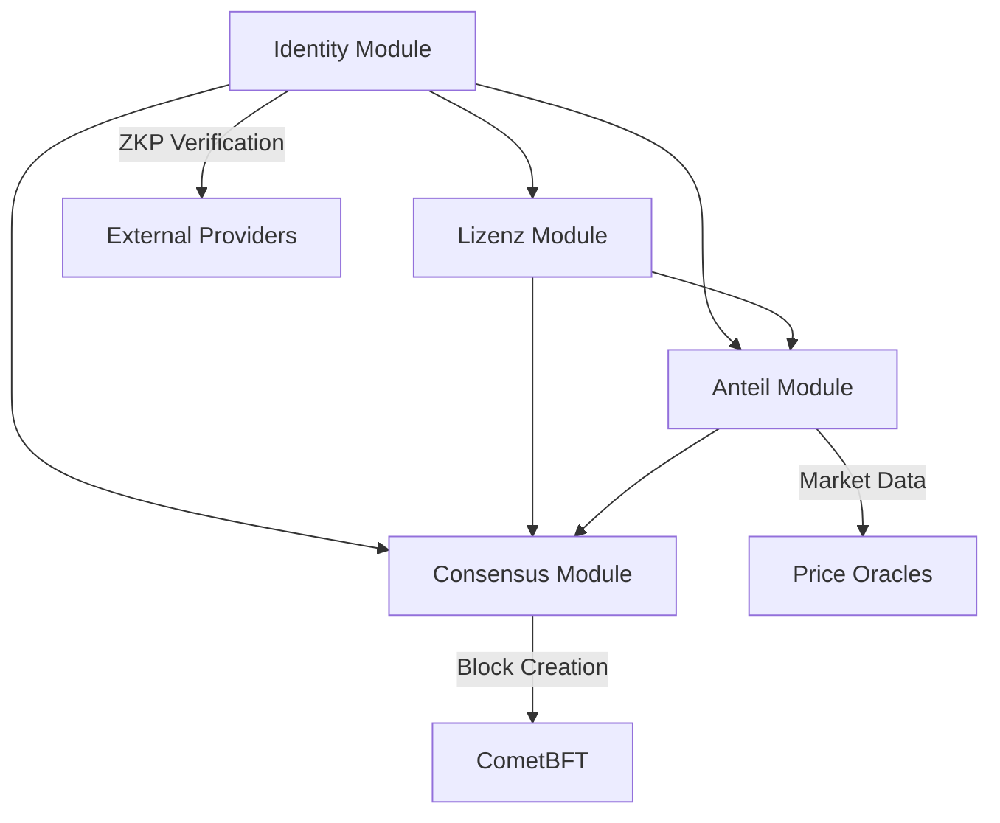

# Архитектура модулей Volnix Protocol

## Обзор

Volnix Protocol построен на базе Cosmos SDK и использует модульную архитектуру для реализации своих уникальных функций. Система включает четыре основных кастомных модуля, каждый из которых отвечает за определенный аспект протокола:

- **Identity (x/ident)** - Управление идентичностью и ролями с ZKP верификацией
- **Lizenz (x/lizenz)** - Управление лицензиями на майнинг (LZN) и MOA мониторинг
- **Anteil (x/anteil)** - Внутренний рынок токенов ANT и аукционная система
- **Consensus (x/consensus)** - Реализация консенсуса Proof-of-Verified-Burn (PoVB)

Все модули интегрированы через стандартные интерфейсы Cosmos SDK и взаимодействуют друг с другом для обеспечения целостности экономической модели и безопасности сети.

## Модуль Identity (x/ident)

### Назначение

Модуль Identity управляет системой идентификации пользователей с использованием Zero-Knowledge Proof (ZKP) для обеспечения приватности и безопасности. Модуль поддерживает три типа ролей: Гость, Гражданин и Валидатор.

### Основные компоненты

#### Типы данных

**VerifiedAccount** - Основная структура для хранения верифицированных аккаунтов:
```protobuf
message VerifiedAccount {
  string address = 1;           // Адрес аккаунта
  Role role = 2;               // Роль пользователя
  google.protobuf.Timestamp last_active = 3;  // Последняя активность
  string identity_hash = 4;     // Хеш идентичности
}
```

**Role** - Перечисление ролей в системе:
```protobuf
enum Role {
  ROLE_UNSPECIFIED = 0;  // Неопределенная роль
  ROLE_GUEST = 1;        // Гость (базовые права)
  ROLE_CITIZEN = 2;      // Гражданин (расширенные права)
  ROLE_VALIDATOR = 3;    // Валидатор (полные права)
}
```

#### Функциональность

1. **ZKP Верификация идентичности**
   - Проверка подлинности без раскрытия личных данных
   - Интеграция с внешними провайдерами верификации
   - Генерация уникальных хешей идентичности

2. **Управление ролями**
   - Автоматическое назначение ролей на основе верификации
   - Миграция ролей между адресами
   - Изменение ролей с соответствующими комиссиями

3. **Мониторинг активности**
   - Отслеживание последней активности пользователей
   - Автоматическая деактивация неактивных аккаунтов
   - Различные периоды активности для разных ролей

### API Спецификации

#### Query API

**GET /volnix/ident/v1/params** - Получение параметров модуля
```json
{
  "params": {
    "citizen_activity_period": "8760h",
    "validator_activity_period": "4320h",
    "max_identities_per_address": 1,
    "require_identity_verification": true,
    "verification_cost": {"denom": "uvx", "amount": "1000000"},
    "migration_fee": {"denom": "uvx", "amount": "500000"},
    "role_change_fee": {"denom": "uvx", "amount": "100000"}
  }
}
```

**GET /volnix/ident/v1/verified_account/{address}** - Получение верифицированного аккаунта
```json
{
  "verified_account": {
    "address": "volnix1...",
    "role": "ROLE_CITIZEN",
    "last_active": "2024-01-01T00:00:00Z",
    "identity_hash": "0x..."
  }
}
```

#### Transaction API

**MsgVerifyIdentity** - Верификация идентичности с ZKP
```json
{
  "address": "volnix1...",
  "zkp_proof": "0x...",
  "verification_provider": "provider_id",
  "verification_cost": {"denom": "uvx", "amount": "1000000"}
}
```

**MsgMigrateRole** - Миграция роли на другой адрес
```json
{
  "from_address": "volnix1...",
  "to_address": "volnix1...",
  "zkp_proof": "0x...",
  "migration_fee": {"denom": "uvx", "amount": "500000"}
}
```

## Модуль Lizenz (x/lizenz)

### Назначение

Модуль Lizenz управляет системой лицензий на майнинг (LZN токены) и мониторингом минимальной обязательной активности (MOA) валидаторов. Модуль обеспечивает контроль качества сети через экономические стимулы.

### Основные компоненты

#### Типы данных

**ActivatedLizenz** - Активированная лицензия валидатора:
```protobuf
message ActivatedLizenz {
  string validator = 1;                    // Адрес валидатора
  string amount = 2;                       // Количество LZN
  google.protobuf.Timestamp activation_time = 3;  // Время активации
  google.protobuf.Timestamp last_activity = 4;    // Последняя активность
  string identity_hash = 5;                // Хеш идентичности
}
```

**MOAStatus** - Статус минимальной обязательной активности:
```protobuf
message MOAStatus {
  string validator = 1;                    // Адрес валидатора
  bool is_active = 2;                      // Статус активности
  google.protobuf.Timestamp last_activity = 3;    // Последняя активность
  string current_moa = 4;                  // Текущий MOA
  string required_moa = 5;                 // Требуемый MOA
  google.protobuf.Timestamp next_check = 6;        // Следующая проверка
  bool is_compliant = 7;                   // Соответствие требованиям
}
```

#### Функциональность

1. **Управление лицензиями LZN**
   - Активация лицензий для валидаторов
   - Деактивация при нарушениях или по запросу
   - Расчет стоимости лицензий на основе рыночных факторов

2. **MOA Мониторинг**
   - Непрерывный мониторинг активности валидаторов
   - Автоматический расчет MOA на основе производительности
   - Система штрафов за несоблюдение требований

3. **Интеграция с консенсусом**
   - Проверка лицензий при выборе создателя блока
   - Обновление статистики активности
   - Координация с модулем consensus

### API Спецификации

#### Query API

**GET /volnix/lizenz/v1/activated/{validator}** - Получение активированной лицензии
```json
{
  "activated_lizenz": {
    "validator": "volnixvaloper1...",
    "amount": "1000000",
    "activation_time": "2024-01-01T00:00:00Z",
    "last_activity": "2024-01-01T12:00:00Z",
    "identity_hash": "0x..."
  }
}
```

**GET /volnix/lizenz/v1/moa_status/{validator}** - Получение статуса MOA
```json
{
  "moa_status": {
    "validator": "volnixvaloper1...",
    "is_active": true,
    "current_moa": "85.5",
    "required_moa": "80.0",
    "is_compliant": true
  }
}
```

#### Transaction API

**MsgActivateLZN** - Активация лицензии LZN
```json
{
  "validator": "volnixvaloper1...",
  "amount": "1000000",
  "identity_hash": "0x..."
}
```

## Модуль Anteil (x/anteil)

### Назначение

Модуль Anteil реализует внутренний рынок токенов ANT (Anteil) с полнофункциональным ордербуком, системой аукционов и управлением позициями пользователей. Модуль обеспечивает ликвидность и ценообразование для токенов производительности сети.

### Основные компоненты

#### Типы данных

**Order** - Ордер на внутреннем рынке:
```protobuf
message Order {
  string order_id = 1;                     // Уникальный ID ордера
  string owner = 2;                        // Владелец ордера
  OrderType order_type = 3;                // Тип ордера (MARKET/LIMIT)
  OrderSide order_side = 4;                // Сторона (BUY/SELL)
  string ant_amount = 5;                   // Количество ANT
  string price = 6;                        // Цена
  OrderStatus status = 7;                  // Статус ордера
  google.protobuf.Timestamp created_at = 8;        // Время создания
  google.protobuf.Timestamp expires_at = 9;        // Время истечения
  string identity_hash = 10;               // Хеш идентичности
}
```

**Auction** - Аукцион ANT токенов:
```protobuf
message Auction {
  string auction_id = 1;                   // ID аукциона
  uint64 block_height = 2;                 // Высота блока
  google.protobuf.Timestamp start_time = 3;        // Время начала
  google.protobuf.Timestamp end_time = 4;          // Время окончания
  AuctionStatus status = 5;                // Статус аукциона
  repeated Bid bids = 6;                   // Список ставок
  string winning_bid = 7;                  // Выигрышная ставка
  string reserve_price = 8;                // Резервная цена
  string ant_amount = 9;                   // Количество ANT
}
```

#### Функциональность

1. **Ордербук и торговля**
   - Размещение лимитных и рыночных ордеров
   - Автоматическое исполнение сделок
   - Управление ликвидностью и спредами

2. **Аукционная система**
   - Периодические аукционы ANT токенов
   - Слепые ставки для справедливого ценообразования
   - Автоматическое определение победителей

3. **Управление позициями**
   - Отслеживание балансов и заблокированных средств
   - История торговых операций
   - Расчет доходности и статистики

### API Спецификации

#### Query API

**GET /volnix/anteil/v1/order_book** - Получение ордербука
```json
{
  "order_book": {
    "buy_orders": [
      {
        "price": "1.50",
        "amount": "1000",
        "total": "1500"
      }
    ],
    "sell_orders": [
      {
        "price": "1.55",
        "amount": "800",
        "total": "1240"
      }
    ]
  }
}
```

**GET /volnix/anteil/v1/user_position/{owner}** - Получение позиции пользователя
```json
{
  "position": {
    "owner": "volnix1...",
    "ant_balance": "5000",
    "locked_ant": "1000",
    "available_ant": "4000",
    "total_trades": "25",
    "total_volume": "50000"
  }
}
```

## Модуль Consensus (x/consensus)

### Назначение

Модуль Consensus реализует уникальный алгоритм консенсуса Proof-of-Verified-Burn (PoVB), который сочетает сжигание токенов с верификацией идентичности для обеспечения безопасности и справедливости сети.

### Основные компоненты

#### Типы данных

**Validator** - Валидатор в системе PoVB:
```protobuf
message Validator {
  string address = 1;                      // Адрес валидатора
  string moniker = 2;                      // Имя валидатора
  ValidatorStatus status = 3;              // Статус валидатора
  string total_burned = 4;                 // Общее количество сожженных токенов
  string current_weight = 5;               // Текущий вес в консенсусе
  google.protobuf.Timestamp last_activity = 6;    // Последняя активность
  string identity_hash = 7;                // Хеш идентичности
}
```

**BurnProof** - Доказательство сжигания токенов:
```protobuf
message BurnProof {
  string validator = 1;                    // Адрес валидатора
  string amount = 2;                       // Количество сожженных токенов
  string burn_hash = 3;                    // Хеш транзакции сжигания
  google.protobuf.Timestamp burn_time = 4;         // Время сжигания
  string zkp_proof = 5;                    // ZKP доказательство
}
```

#### Функциональность

1. **Алгоритм PoVB**
   - Выбор создателя блока на основе сжигания и верификации
   - Слепой аукцион для справедливого распределения
   - Защита от атак Сивиллы через ZKP

2. **Динамическое время блока**
   - Адаптация времени блока на основе активности сети
   - Халвинг механизм для контроля инфляции
   - Оптимизация производительности сети

3. **Управление валидаторами**
   - Регистрация и активация валидаторов
   - Мониторинг производительности и соответствия
   - Система наказаний за нарушения

### API Спецификации

#### Query API

**GET /volnix/consensus/v1/validators** - Получение списка валидаторов
```json
{
  "validators": [
    {
      "address": "volnixvaloper1...",
      "moniker": "Validator1",
      "status": "VALIDATOR_STATUS_ACTIVE",
      "total_burned": "1000000",
      "current_weight": "0.15",
      "identity_hash": "0x..."
    }
  ]
}
```

#### Transaction API

**MsgSelectBlockCreator** - Выбор создателя блока
```json
{
  "creator": "volnix1..."
}
```

## Межмодульные взаимодействия

### Схема взаимодействия



### Ключевые интеграции

1. **Identity ↔ Lizenz**
   - Верификация идентичности для активации лицензий
   - Проверка ролей при операциях с LZN

2. **Identity ↔ Anteil**
   - Контроль доступа к торговым операциям
   - Верификация участников аукционов

3. **Lizenz ↔ Consensus**
   - Проверка активных лицензий при выборе валидаторов
   - Обновление MOA статистики на основе консенсуса

4. **Anteil ↔ Consensus**
   - Использование ANT в алгоритме выбора создателя блока
   - Распределение наград через внутренний рынок

## Безопасность и валидация

### Принципы безопасности

1. **Криптографическая защита**
   - Все операции подписываются приватными ключами
   - ZKP для защиты приватности
   - Хеширование критических данных

2. **Экономические стимулы**
   - Штрафы за нарушение правил
   - Депозиты для участия в консенсусе
   - Рыночные механизмы для справедливого ценообразования

3. **Валидация данных**
   - Строгая проверка всех входных параметров
   - Проверка состояния перед выполнением операций
   - Атомарность транзакций

### Обработка ошибок

Все модули используют стандартизированную систему обработки ошибок:

```go
// Примеры ошибок модуля Identity
var (
    ErrEmptyAddress      = errors.New("address cannot be empty")
    ErrInvalidRole       = errors.New("invalid role specified")
    ErrEmptyIdentityHash = errors.New("identity hash cannot be empty")
)
```

## Развертывание и конфигурация

### Параметры модулей

Каждый модуль имеет настраиваемые параметры, которые можно изменять через governance:

```toml
# app.toml конфигурация
[ident]
citizen_activity_period = "8760h"
validator_activity_period = "4320h"
require_identity_verification = true

[lizenz]
min_license_amount = "1000000"
moa_check_interval = "24h"
penalty_rate = "0.1"

[anteil]
min_order_amount = "100"
auction_duration = "1h"
market_fee_rate = "0.001"

[consensus]
base_block_time = "5s"
min_burn_amount = "1000000"
max_validators = 100
```

### Мониторинг и метрики

Модули экспортируют метрики для мониторинга:

- Количество активных валидаторов
- Объем торгов на внутреннем рынке
- Статистика верификации идентичности
- Производительность консенсуса

Эта архитектура обеспечивает масштабируемость, безопасность и эффективность Volnix Protocol, создавая основу для инновационной блокчейн-экосистемы с уникальными экономическими стимулами и механизмами консенсуса.