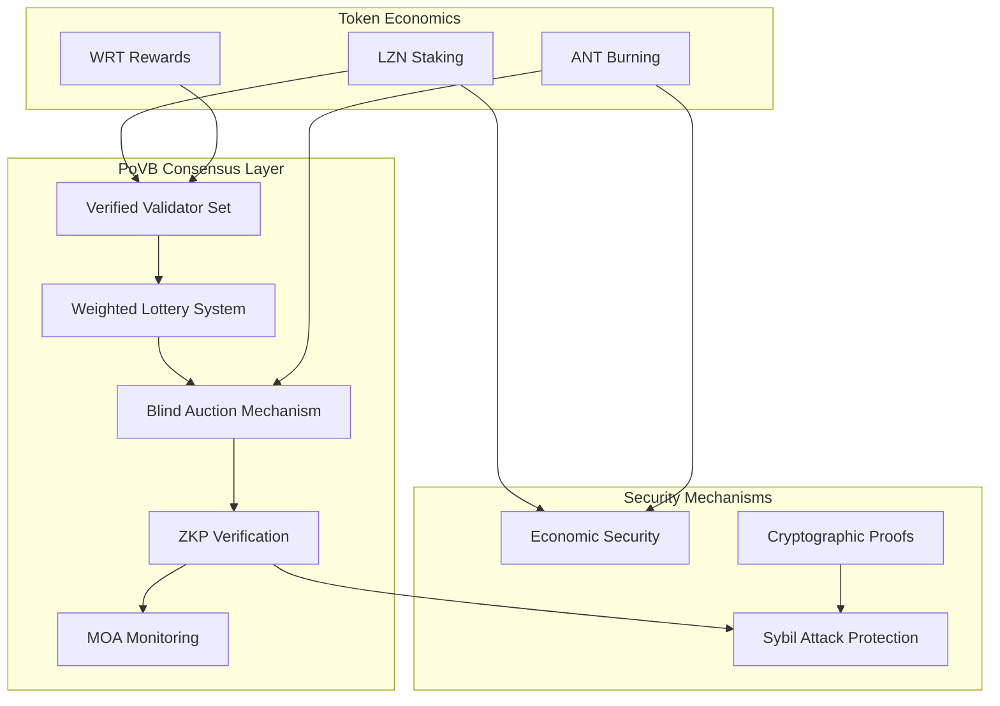
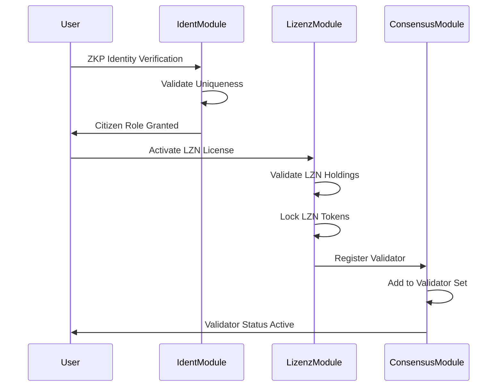
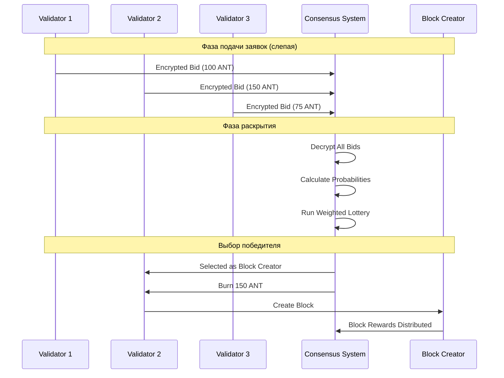
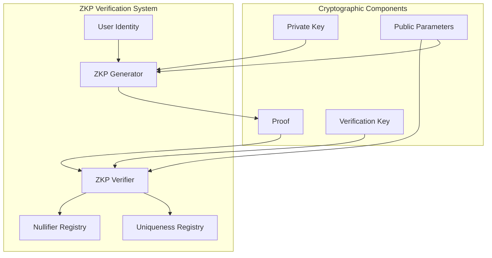
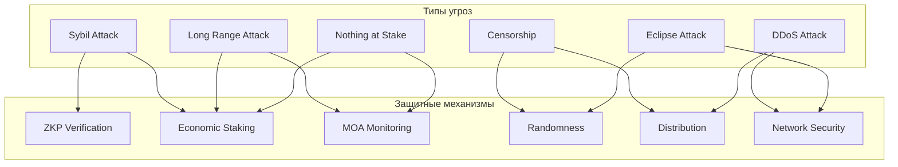
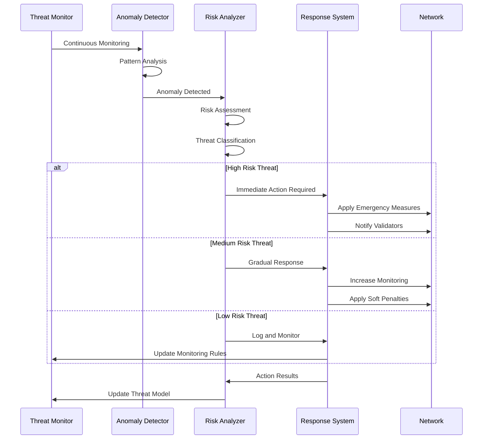

# Механизм консенсуса PoVB (Proof-of-Verified-Burn)

## Обзор

Proof-of-Verified-Burn (PoVB) - это инновационный гибридный консенсус-механизм, разработанный специально для Volnix Protocol. PoVB объединяет элементы Proof-of-Stake через активацию LZN токенов с механизмом сжигания ANT токенов для создания блоков, обеспечивая справедливое распределение возможностей создания блоков и защиту от различных типов атак.

## Архитектура консенсуса PoVB

### Основные компоненты



### Двухуровневая система безопасности

PoVB реализует двухуровневую систему безопасности:

1. **Уровень идентичности**: ZKP верификация уникальности участников
2. **Уровень экономики**: Стейкинг LZN и сжигание ANT токенов

## Детальное описание алгоритма PoVB

### 1. Инициализация валидаторов

#### Процесс становления валидатором



#### Математическая модель активации

**Требования для активации валидатора:**
```
Минимальные_LZN = 1,000 LZN
Максимальные_LZN_на_валидатора = 330,000 LZN (33% от общей эмиссии)
Стоимость_активации = Базовая_стоимость × (1 + Доля_валидатора²)
```

**Формула расчета веса валидатора:**
```
Вес_валидатора = Активированные_LZN_валидатора / Общие_активированные_LZN
Пассивный_доход = Вес_валидатора × Базовая_награда_блока
```

### 2. Механизм выбора создателя блока

#### Взвешенная лотерея с ANT сжиганием

Выбор создателя блока происходит через комбинацию взвешенной лотереи и слепого аукциона:

```go
// Алгоритм выбора создателя блока
func (k Keeper) SelectBlockCreator(ctx sdk.Context, height uint64) (*BlockCreator, error) {
    validators := k.GetAllValidators(ctx)
    
    // Расчет весов на основе ANT баланса и активности
    weights := make([]uint64, len(validators))
    totalWeight := uint64(0)
    
    for i, validator := range validators {
        antBalance, _ := strconv.ParseUint(validator.AntBalance, 10, 64)
        activityScore, _ := strconv.ParseUint(validator.ActivityScore, 10, 64)
        
        // Вес = ANT баланс + очки активности
        weights[i] = antBalance + activityScore
        totalWeight += weights[i]
    }
    
    // Взвешенный случайный выбор
    randomWeight := rand.Uint64() % totalWeight
    currentWeight := uint64(0)
    
    for i, weight := range weights {
        currentWeight += weight
        if randomWeight < currentWeight {
            return createBlockCreator(validators[i], height)
        }
    }
}
```

#### Формулы вероятности выбора

**Базовая вероятность выбора:**
```
P(выбор_валидатора_i) = Вес_валидатора_i / Σ(Веса_всех_валидаторов)

где:
Вес_валидатора_i = ANT_баланс_i + Очки_активности_i
Очки_активности_i = f(Блоки_созданные, Транзакции_обработанные, MOA_соответствие)
```

**Функция расчета очков активности:**
```
Очки_активности = (Блоки_созданные × 10) + 
                  (Транзакции_обработанные × 0.1) + 
                  (MOA_соответствие × 100)
```

### 3. Слепой аукцион блоков

#### Механизм слепого аукциона

Слепой аукцион обеспечивает справедливое распределение возможностей создания блоков:



#### Алгоритм слепого аукциона

```go
type BlindAuction struct {
    Round      uint64
    Bids       []EncryptedBid
    Revealed   []RevealedBid
    Winner     string
    BurnAmount uint64
}

type EncryptedBid struct {
    Validator     string
    EncryptedData []byte
    Commitment    []byte
}

type RevealedBid struct {
    Validator string
    Amount    uint64
    Nonce     []byte
    Signature []byte
}

func (k Keeper) ProcessBlindAuction(ctx sdk.Context) (*BlockCreator, error) {
    // 1. Сбор зашифрованных заявок
    encryptedBids := k.CollectEncryptedBids(ctx)
    
    // 2. Раскрытие заявок
    revealedBids := k.RevealBids(ctx, encryptedBids)
    
    // 3. Валидация заявок
    validBids := k.ValidateBids(ctx, revealedBids)
    
    // 4. Взвешенная лотерея
    winner := k.RunWeightedLottery(ctx, validBids)
    
    // 5. Сжигание ANT токенов победителя
    k.BurnANTTokens(ctx, winner.Validator, winner.Amount)
    
    return k.CreateBlockCreator(ctx, winner)
}
```

### 4. Динамическое время блока

#### Адаптивный алгоритм времени блока

Время блока динамически адаптируется к активности сети:

```go
func (k Keeper) CalculateBlockTime(ctx sdk.Context, antAmount string) (time.Duration, error) {
    params := k.GetParams(ctx)
    
    antAmountInt, err := strconv.ParseUint(antAmount, 10, 64)
    if err != nil {
        return 0, types.ErrInvalidAntAmount
    }
    
    baseBlockTime, _ := time.ParseDuration(params.BaseBlockTime)
    
    // Расчет коэффициента активности
    var activityFactor float64
    if antAmountInt >= params.HighActivityThreshold {
        activityFactor = 0.5  // Быстрые блоки при высокой активности
    } else if antAmountInt >= params.LowActivityThreshold {
        activityFactor = 0.75 // Умеренная скорость
    } else {
        activityFactor = 1.0  // Обычная скорость
    }
    
    dynamicBlockTime := float64(baseBlockTime) * activityFactor
    return time.Duration(dynamicBlockTime), nil
}
```

#### Математическая модель динамического времени

**Формула расчета времени блока:**
```
Время_блока = Базовое_время × Коэффициент_активности

где:
Коэффициент_активности = f(Общая_активность_ANT, Количество_валидаторов, Загрузка_сети)

Общая_активность_ANT = Σ(ANT_сожженные_за_период) / Период
```

**Пороги активности:**
```
Высокая_активность: ANT_активность ≥ 1000 ANT/час → Коэффициент = 0.5
Средняя_активность: 100 ≤ ANT_активность < 1000 → Коэффициент = 0.75
Низкая_активность: ANT_активность < 100 → Коэффициент = 1.0
```

## ZKP верификация и защита от атак Сивиллы

### Механизм ZKP верификации

#### Архитектура ZKP системы



#### Протокол ZKP верификации

**Генерация доказательства:**
```
Доказательство = ZKP_Generate(
    statement: "Я уникальный пользователь",
    witness: (private_key, biometric_hash, timestamp),
    public_input: (public_key, nullifier)
)
```

**Верификация доказательства:**
```go
func (k Keeper) VerifyZKProof(ctx sdk.Context, proof ZKProof) (bool, error) {
    // 1. Проверка криптографической корректности
    if !crypto.VerifyZKProof(proof.Proof, proof.PublicInputs) {
        return false, types.ErrInvalidZKProof
    }
    
    // 2. Проверка уникальности nullifier
    if k.IsNullifierUsed(ctx, proof.Nullifier) {
        return false, types.ErrDuplicateNullifier
    }
    
    // 3. Проверка временных ограничений
    if time.Since(proof.Timestamp) > MaxProofAge {
        return false, types.ErrExpiredProof
    }
    
    // 4. Регистрация nullifier
    k.RegisterNullifier(ctx, proof.Nullifier)
    
    return true, nil
}
```

### Защита от атак Сивиллы

#### Многоуровневая защита

**Уровень 1: Криптографическая уникальность**
```
Nullifier = Hash(private_key || biometric_hash || epoch)
```

**Уровень 2: Экономические барьеры**
```
Стоимость_создания_идентичности = Базовая_стоимость × (1 + Количество_существующих_идентичностей / 1000)
```

**Уровень 3: Поведенческий анализ**
```go
type SybilDetection struct {
    AddressPattern    []string
    TransactionPattern []TxPattern
    TimingPattern     []time.Duration
    NetworkPattern    []NetworkMetric
}

func (k Keeper) DetectSybilAttack(ctx sdk.Context, address string) (bool, float64) {
    patterns := k.GetUserPatterns(ctx, address)
    
    // Анализ паттернов поведения
    suspicionScore := 0.0
    
    // Проверка временных паттернов
    if k.HasSuspiciousTimingPattern(patterns.TimingPattern) {
        suspicionScore += 0.3
    }
    
    // Проверка сетевых паттернов
    if k.HasSuspiciousNetworkPattern(patterns.NetworkPattern) {
        suspicionScore += 0.4
    }
    
    // Проверка транзакционных паттернов
    if k.HasSuspiciousTransactionPattern(patterns.TransactionPattern) {
        suspicionScore += 0.3
    }
    
    return suspicionScore > 0.7, suspicionScore
}
```

#### Алгоритм обнаружения Сивилл

**Метрики подозрительности:**
1. **Временная корреляция**: Синхронные действия между аккаунтами
2. **Сетевая близость**: Одинаковые IP адреса или подсети
3. **Поведенческое сходство**: Идентичные паттерны транзакций
4. **Экономическая связанность**: Переводы между подозрительными аккаунтами

**Формула расчета подозрительности:**
```
Подозрительность = w₁×Временная_корреляция + 
                   w₂×Сетевая_близость + 
                   w₃×Поведенческое_сходство + 
                   w₄×Экономическая_связанность

где w₁ + w₂ + w₃ + w₄ = 1.0
```

## Математические модели консенсуса

### Модель безопасности сети

#### Экономическая безопасность

**Стоимость атаки на сеть:**
```
Стоимость_атаки = min(Стоимость_51%_LZN, Стоимость_контроля_ANT)

где:
Стоимость_51%_LZN = 0.51 × Общая_стоимость_активированных_LZN
Стоимость_контроля_ANT = Стоимость_монополизации_рынка_ANT
```

**Модель экономического равновесия:**
```
Прибыль_честного_валидатора > Прибыль_от_атаки - Стоимость_атаки - Риск_наказания

где:
Прибыль_честного_валидатора = Пассивный_доход + Ожидаемый_активный_доход
Риск_наказания = Вероятность_обнаружения × Размер_штрафа
```

#### Криптографическая безопасность

**Стойкость ZKP схемы:**
```
Безопасность_ZKP ≥ 2^λ

где λ = 128 бит (уровень безопасности)
```

**Вероятность коллизии nullifier:**
```
P(коллизия) ≤ q²/(2^n)

где:
q = количество сгенерированных nullifier
n = 256 бит (размер nullifier)
```

### Модель производительности

#### Пропускная способность

**Теоретическая пропускная способность:**
```
TPS_теоретическая = Размер_блока / (Размер_транзакции × Время_блока)

где:
Размер_блока = 2 MB
Размер_транзакции ≈ 400 байт
Время_блока = 1-60 секунд (динамическое)
```

**Практическая пропускная способность:**
```
TPS_практическая = TPS_теоретическая × Коэффициент_эффективности

где:
Коэффициент_эффективности ≈ 0.7-0.9 (зависит от нагрузки)
```

#### Время финализации

**Время финализации блока:**
```
Время_финализации = Время_создания_блока + Время_консенсуса + Время_коммита

где:
Время_создания_блока ≈ 100-500 мс
Время_консенсуса ≈ 1-3 секунды
Время_коммита ≈ 100-200 мс
```

### Модель стимулов

#### Оптимальная стратегия валидатора

**Функция полезности валидатора:**
```
U(s) = E[Доходы(s)] - Затраты(s) - Риски(s)

где:
s = стратегия валидатора
E[Доходы(s)] = ожидаемые доходы при стратегии s
Затраты(s) = операционные затраты + стоимость ANT
Риски(s) = ожидаемые потери от штрафов
```

**Условие равновесия Нэша:**
```
∂U(s*)/∂s = 0

где s* = оптимальная стратегия в равновесии
```

#### Модель аукциона ANT

**Ожидаемая прибыль от участия в аукционе:**
```
E[Прибыль] = P(победа) × Комиссии_блока - Стоимость_ANT

где:
P(победа) = Ставка_валидатора / Σ(Все_ставки)
Комиссии_блока = Σ(Комиссии_транзакций_в_блоке)
```

**Оптимальная ставка в аукционе:**
```
Ставка_оптимальная = √(Ожидаемые_комиссии × Σ(Ставки_конкурентов))
```

## Диаграммы безопасности и защиты от угроз

### Матрица угроз и защитных механизмов



### Анализ векторов атак

#### 1. Атака Сивиллы

**Вектор атаки:**
- Создание множественных поддельных идентичностей
- Попытка получить непропорциональное влияние в сети

**Защитные механизмы:**
```go
// Многоуровневая защита от Сивилл
type SybilProtection struct {
    ZKPVerification    bool    // Криптографическая уникальность
    EconomicBarriers   uint64  // Экономические барьеры входа
    BehavioralAnalysis bool    // Анализ поведенческих паттернов
    NetworkAnalysis    bool    // Анализ сетевых паттернов
}

func (sp *SybilProtection) CalculateRisk(identity Identity) float64 {
    risk := 0.0
    
    if !sp.ZKPVerification {
        risk += 0.4 // Высокий риск без ZKP
    }
    
    if sp.EconomicBarriers < MinimumStake {
        risk += 0.3 // Низкие экономические барьеры
    }
    
    if sp.DetectSuspiciousBehavior(identity) {
        risk += 0.2 // Подозрительное поведение
    }
    
    if sp.DetectNetworkAnomalies(identity) {
        risk += 0.1 // Сетевые аномалии
    }
    
    return risk
}
```

#### 2. Long Range Attack

**Вектор атаки:**
- Создание альтернативной истории блокчейна с прошлого момента
- Использование старых ключей валидаторов

**Защитные механизмы:**
```go
type LongRangeProtection struct {
    CheckpointInterval uint64  // Интервал чекпоинтов
    UnbondingPeriod   uint64  // Период разблокировки стейка
    SlashingConditions []SlashingRule
}

func (lrp *LongRangeProtection) ValidateHistoricalBlock(block Block) error {
    // Проверка чекпоинтов
    if block.Height < lrp.GetLastCheckpoint() {
        return errors.New("block before last checkpoint")
    }
    
    // Проверка валидности валидаторов на момент блока
    validators := lrp.GetValidatorsAtHeight(block.Height)
    if !lrp.ValidateValidatorSet(block, validators) {
        return errors.New("invalid validator set")
    }
    
    return nil
}
```

#### 3. Nothing at Stake

**Вектор атаки:**
- Валидация множественных конкурирующих цепей
- Отсутствие экономических стимулов для честного поведения

**Защитные механизмы:**
```go
type NothingAtStakeProtection struct {
    SlashingRules    []SlashingRule
    MOARequirements  MOAConfig
    EconomicPenalties PenaltyConfig
}

func (nasp *NothingAtStakeProtection) DetectDoubleVoting(validator string, votes []Vote) bool {
    votesByHeight := make(map[uint64][]Vote)
    
    for _, vote := range votes {
        votesByHeight[vote.Height] = append(votesByHeight[vote.Height], vote)
    }
    
    // Проверка на множественное голосование на одной высоте
    for height, heightVotes := range votesByHeight {
        if len(heightVotes) > 1 {
            nasp.ApplySlashing(validator, height, heightVotes)
            return true
        }
    }
    
    return false
}
```

### Диаграмма процесса обнаружения и реагирования на угрозы



## Параметры консенсуса и их настройка

### Основные параметры PoVB

```go
type ConsensusParams struct {
    // Параметры времени блока
    BaseBlockTime               string  // "5s" - базовое время блока
    HighActivityThreshold       uint64  // 1000 - порог высокой активности ANT
    LowActivityThreshold        uint64  // 100 - порог низкой активности ANT
    
    // Параметры сжигания ANT
    MinBurnAmount               string  // "1000000uvx" - минимальная сумма сжигания
    MaxBurnAmount               string  // "1000000000uvx" - максимальная сумма сжигания
    
    // Параметры выбора создателя блока
    BlockCreatorSelectionRounds uint64  // 10 - количество раундов выбора
    
    // Параметры активности
    ActivityDecayRate           string  // "0.95" - коэффициент затухания активности
    MoaPenaltyRate              string  // "0.1" - коэффициент штрафа за MOA
}
```

### Адаптивные параметры

#### Динамическая корректировка параметров

```go
func (k Keeper) UpdateConsensusParams(ctx sdk.Context) error {
    currentParams := k.GetParams(ctx)
    networkMetrics := k.GetNetworkMetrics(ctx)
    
    // Адаптация времени блока на основе загрузки сети
    if networkMetrics.AverageBlockUtilization > 0.8 {
        // Уменьшение времени блока при высокой загрузке
        newBaseTime := k.AdjustBlockTime(currentParams.BaseBlockTime, -0.1)
        currentParams.BaseBlockTime = newBaseTime
    } else if networkMetrics.AverageBlockUtilization < 0.3 {
        // Увеличение времени блока при низкой загрузке
        newBaseTime := k.AdjustBlockTime(currentParams.BaseBlockTime, 0.1)
        currentParams.BaseBlockTime = newBaseTime
    }
    
    // Адаптация порогов активности
    if networkMetrics.TotalANTBurned > currentParams.HighActivityThreshold * 2 {
        currentParams.HighActivityThreshold *= 1.2
        currentParams.LowActivityThreshold *= 1.2
    }
    
    k.SetParams(ctx, currentParams)
    return nil
}
```

### Мониторинг и метрики консенсуса

#### Ключевые метрики производительности

```go
type ConsensusMetrics struct {
    // Метрики производительности
    AverageBlockTime        time.Duration
    TransactionsPerSecond   float64
    BlockUtilization        float64
    
    // Метрики безопасности
    ActiveValidators        uint64
    TotalStakedLZN         uint64
    TotalBurnedANT         uint64
    
    // Метрики децентрализации
    ValidatorDistribution   map[string]float64
    GeographicDistribution  map[string]uint64
    
    // Метрики экономики
    AverageRewardPerBlock   uint64
    MOAComplianceRate       float64
    SlashingEvents          uint64
}

func (k Keeper) CollectConsensusMetrics(ctx sdk.Context) ConsensusMetrics {
    metrics := ConsensusMetrics{}
    
    // Сбор метрик производительности
    metrics.AverageBlockTime = k.CalculateAverageBlockTime(ctx, 100) // За последние 100 блоков
    metrics.TransactionsPerSecond = k.CalculateTPS(ctx, 100)
    metrics.BlockUtilization = k.CalculateBlockUtilization(ctx, 100)
    
    // Сбор метрик безопасности
    validators := k.GetAllValidators(ctx)
    metrics.ActiveValidators = uint64(len(validators))
    metrics.TotalStakedLZN = k.CalculateTotalStakedLZN(ctx)
    metrics.TotalBurnedANT = k.CalculateTotalBurnedANT(ctx)
    
    // Сбор метрик децентрализации
    metrics.ValidatorDistribution = k.CalculateValidatorDistribution(ctx)
    
    return metrics
}
```

## Заключение

Механизм консенсуса PoVB представляет собой инновационное решение, которое:

1. **Обеспечивает справедливость** через комбинацию ZKP верификации и экономических стимулов
2. **Гарантирует безопасность** через многоуровневую защиту от различных типов атак
3. **Поддерживает эффективность** через динамическое время блока и оптимизированные алгоритмы
4. **Стимулирует активность** через механизм сжигания ANT и систему наград
5. **Предотвращает централизацию** через ограничения на концентрацию стейка и слепые аукционы

Математические модели и криптографические протоколы обеспечивают теоретическую обоснованность и практическую надежность консенсуса PoVB, создавая основу для устойчивого и справедливого блокчейна.