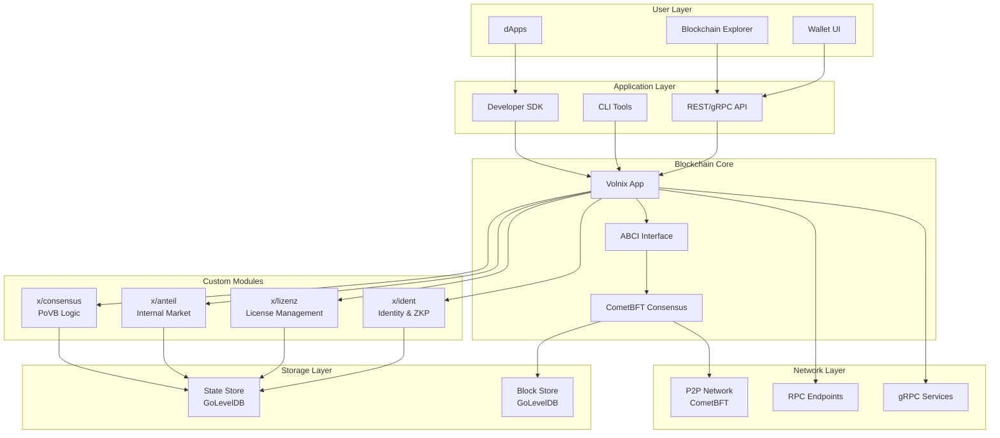
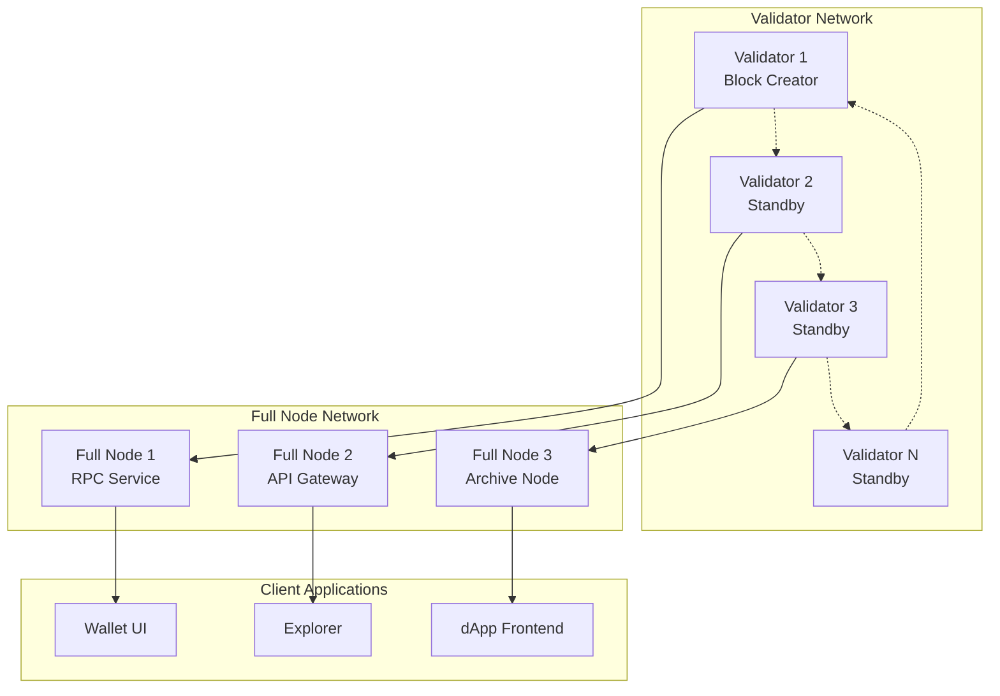

# System Overview - Volnix Protocol Infrastructure

## Executive Summary

Volnix Protocol is a sovereign Layer-1 blockchain built on Cosmos SDK with a hybrid Proof-of-Verified-Burn (PoVB) consensus mechanism and a three-tier economic model. The protocol combines the security of traditional Proof-of-Stake with innovative burn-based consensus, achieving high performance (10,000+ TPS) while maintaining 99.9% energy efficiency compared to Proof-of-Work systems.

### Key Innovations

- **Hybrid PoVB Consensus**: Unique combination of staking and token burning for block creation
- **ZKP Identity Verification**: Zero-knowledge proofs for privacy-preserving identity management
- **Three-Tier Economy**: WRT (value/governance), LZN (mining licenses), ANT (performance rights)
- **Cosmos Ecosystem Integration**: Full compatibility with IBC and Cosmos infrastructure
- **Energy Efficiency**: 99.9% reduction in energy consumption vs. traditional PoW

### Business Value

- **High Throughput**: Up to 10,000 transactions per second
- **Low Latency**: 3-5 second block times with dynamic adjustment
- **Economic Sustainability**: Self-regulating economy through halving and market mechanisms
- **Developer Friendly**: Cosmos SDK modules with comprehensive tooling
- **Enterprise Ready**: Role-based access control and compliance features

## High-Level Architecture

## Core Components

### 1. Blockchain Core

#### Volnix Application (`app/`)
- **Purpose**: Main blockchain application built on Cosmos SDK
- **Components**: Module manager, ABCI handlers, genesis configuration
- **Key Features**: 
  - Custom module integration
  - Transaction routing and validation
  - State management coordination
  - Inter-module communication

#### CometBFT Integration
- **Version**: v0.38.17
- **Role**: Consensus engine and networking layer
- **Features**:
  - Byzantine Fault Tolerant consensus
  - P2P networking protocol
  - Block production and validation
  - State synchronization

### 2. Custom Modules

#### Identity Module (`x/ident`)
- **Purpose**: Role-based identity management with ZKP verification
- **Key Features**:
  - Three role types: Guest, Citizen, Validator
  - Zero-knowledge proof verification
  - Identity migration ("digital inheritance")
  - Activity tracking and compliance

#### License Module (`x/lizenz`)
- **Purpose**: Mining license management and MOA (Minimum Obligation Activity) monitoring
- **Key Features**:
  - LZN token activation and deactivation
  - Validator activity monitoring
  - MOA compliance checking
  - Penalty system for non-compliance

#### Anteil Module (`x/anteil`)
- **Purpose**: Internal market for ANT (performance rights) trading
- **Key Features**:
  - Order book management
  - Auction system for ANT distribution
  - Trade execution and settlement
  - User position tracking

#### Consensus Module (`x/consensus`)
- **Purpose**: PoVB consensus logic and validator management
- **Key Features**:
  - Burn proof verification
  - Block creator selection algorithm
  - Activity scoring system
  - Halving mechanism implementation

### 3. User Interfaces

#### Wallet UI (`wallet-ui/`)
- **Technology**: React 18 + TypeScript
- **Features**:
  - Multi-role wallet support (Guest, Citizen, Validator)
  - Token management (WRT, LZN, ANT)
  - Transaction history and monitoring
  - CosmJS integration for blockchain interaction

#### Blockchain Explorer (`blockchain-explorer/`)
- **Technology**: HTML/CSS/JavaScript with PowerShell backend
- **Features**:
  - Real-time network monitoring
  - Block and transaction exploration
  - Validator statistics and performance
  - PoVB consensus metrics

### 4. Developer Tools

#### CLI Tools (`cmd/volnixd`)
- **Purpose**: Command-line interface for node management
- **Commands**:
  - Node initialization and configuration
  - Key management and wallet operations
  - Transaction creation and broadcasting
  - Network status and debugging

#### SDK and APIs
- **gRPC Services**: Module-specific query and transaction services
- **REST API**: HTTP endpoints for web integration
- **CosmJS Integration**: JavaScript/TypeScript client library support

## Technology Stack

### Core Framework
| Component | Version | Purpose |
|-----------|---------|---------|
| **Cosmos SDK** | v0.53.4 | Blockchain application framework |
| **CometBFT** | v0.38.17 | Consensus engine and networking |
| **Go** | 1.21+ | Primary development language |
| **Protocol Buffers** | v3 | Serialization and API definitions |

### Storage and Database
| Component | Version | Purpose |
|-----------|---------|---------|
| **GoLevelDB** | Latest | State and block storage |
| **IAVL Tree** | v1.2.2 | Merkle tree for state verification |
| **BadgerDB** | v4.2.0 | Alternative storage backend |

### Networking and APIs
| Component | Version | Purpose |
|-----------|---------|---------|
| **gRPC** | v1.73.0 | High-performance RPC framework |
| **gRPC-Gateway** | v2.27.1 | REST API generation |
| **WebSocket** | Native | Real-time data streaming |

### Frontend Technologies
| Component | Version | Purpose |
|-----------|---------|---------|
| **React** | 18.2.0 | Wallet UI framework |
| **TypeScript** | 4.9.5 | Type-safe JavaScript |
| **CosmJS** | 0.32.2 | Blockchain client library |
| **Lucide React** | 0.263.1 | Icon library |

### Development and Build Tools
| Component | Version | Purpose |
|-----------|---------|---------|
| **Make** | Native | Build automation |
| **PowerShell** | 5.1+ | Windows deployment scripts |
| **Buf** | Latest | Protocol buffer management |
| **golangci-lint** | Latest | Code quality and linting |

## Network Architecture

### Node Types and Roles

#### Validator Nodes
- **Requirements**: LZN license activation, MOA compliance
- **Responsibilities**: Block creation, transaction validation, consensus participation
- **Rewards**: Block rewards, transaction fees, ANT auction proceeds

#### Full Nodes
- **Purpose**: Network relay, API services, data availability
- **Requirements**: Standard hardware, network connectivity
- **Services**: RPC endpoints, state synchronization, transaction broadcasting

#### Light Clients
- **Purpose**: Mobile and web applications
- **Features**: Header verification, minimal storage requirements
- **Use Cases**: Wallet applications, dApp frontends

### Network Topology

### Port Configuration

| Service | Port | Protocol | Purpose |
|---------|------|----------|---------|
| **P2P Network** | 26656 | TCP | Inter-node communication |
| **RPC Server** | 26657 | HTTP/WebSocket | Query and transaction API |
| **gRPC Server** | 9090 | gRPC | High-performance API |
| **gRPC-Web** | 9091 | HTTP | Browser-compatible gRPC |
| **REST API** | 1317 | HTTP | RESTful API endpoints |
| **Prometheus** | 26660 | HTTP | Metrics and monitoring |

## Performance Characteristics

### Throughput and Latency
- **Transaction Throughput**: 10,000+ TPS (theoretical maximum)
- **Block Time**: 3-5 seconds (dynamic adjustment based on network activity)
- **Finality**: Instant (single block confirmation)
- **State Size**: Optimized with pruning (configurable retention)

### Scalability Features
- **Horizontal Scaling**: IBC compatibility for inter-chain communication
- **State Pruning**: Configurable historical data retention
- **Light Client Support**: Minimal resource requirements for mobile/web
- **Modular Architecture**: Independent module scaling and optimization

### Resource Requirements

#### Validator Node (Minimum)
- **CPU**: 4 cores, 2.5GHz+
- **RAM**: 16GB
- **Storage**: 500GB SSD (growing ~100GB/year)
- **Network**: 100Mbps symmetric, <50ms latency

#### Full Node (Recommended)
- **CPU**: 2 cores, 2.0GHz+
- **RAM**: 8GB
- **Storage**: 200GB SSD
- **Network**: 50Mbps symmetric

## Comparison with Other Blockchain Platforms

| Feature | Volnix Protocol | Ethereum 2.0 | Cosmos Hub | Polkadot |
|---------|----------------|---------------|------------|----------|
| **Consensus** | PoVB (Hybrid) | PoS | Tendermint PoS | NPoS |
| **TPS** | 10,000+ | 100,000+ (sharded) | 10,000+ | 1,000+ |
| **Block Time** | 3-5s (dynamic) | 12s | 6s | 6s |
| **Finality** | Instant | 2 epochs (~13min) | Instant | Instant |
| **Energy Efficiency** | 99.9% vs PoW | 99.9% vs PoW | 99.9% vs PoW | 99.9% vs PoW |
| **Interoperability** | IBC Native | Bridges | IBC Native | XCMP |
| **Governance** | On-chain + Economic | On-chain | On-chain | On-chain |
| **Developer Experience** | Cosmos SDK | Solidity/Vyper | Cosmos SDK | Substrate |
| **Economic Model** | Three-tier (WRT/LZN/ANT) | Single (ETH) | Single (ATOM) | Multi (DOT/KSM) |
| **Identity System** | ZKP Built-in | External solutions | External solutions | External solutions |
| **Unique Features** | Burn-based consensus, Internal market | Sharding, EVM | IBC protocol | Parachain slots |

### Competitive Advantages

1. **Economic Innovation**: Three-tier token system creates sustainable economic incentives
2. **Energy Efficiency**: PoVB consensus reduces energy consumption while maintaining security
3. **Built-in Identity**: ZKP-based identity system eliminates need for external solutions
4. **Performance**: High throughput with instant finality and dynamic block times
5. **Developer Experience**: Familiar Cosmos SDK with enhanced modules

### Trade-offs and Considerations

1. **Network Effects**: Smaller ecosystem compared to Ethereum
2. **Complexity**: Three-tier economy requires user education
3. **Maturity**: Newer consensus mechanism needs long-term validation
4. **Interoperability**: Limited to IBC ecosystem initially

## Security Model

### Consensus Security
- **Byzantine Fault Tolerance**: Up to 1/3 malicious validators
- **Economic Security**: Staked value and burn requirements
- **Sybil Resistance**: ZKP identity verification prevents duplicate validators
- **Long-range Attack Prevention**: Checkpointing and social consensus

### Economic Security
- **Validator Bonds**: LZN license requirements create economic stake
- **Slashing Conditions**: MOA violations and malicious behavior penalties
- **Burn Mechanism**: ANT burning creates deflationary pressure
- **Market Dynamics**: Internal ANT market provides price discovery

### Network Security
- **P2P Encryption**: All inter-node communication encrypted
- **DDoS Protection**: Rate limiting and connection management
- **State Verification**: Merkle proofs for all state transitions
- **Upgrade Governance**: On-chain governance for protocol upgrades

## Deployment and Operations

### Supported Platforms
- **Linux**: Ubuntu 20.04+, CentOS 8+, Debian 11+
- **Windows**: Windows 10/11, Windows Server 2019+
- **macOS**: macOS 11+ (Intel and Apple Silicon)
- **Docker**: Multi-architecture container support

### Deployment Options
- **Standalone Node**: Single validator or full node
- **Testnet**: Multi-node test environment
- **Mainnet**: Production network participation
- **Private Network**: Custom chain deployment

### Monitoring and Maintenance
- **Prometheus Metrics**: Comprehensive performance monitoring
- **Health Checks**: Automated node status verification
- **Log Management**: Structured logging with configurable levels
- **Backup Procedures**: State and key backup automation

## Future Roadmap

### Short-term (3-6 months)
- **Mainnet Launch**: Production network deployment
- **Mobile Wallets**: iOS and Android applications
- **DeFi Integrations**: DEX and lending protocol support
- **Performance Optimization**: TPS and latency improvements

### Medium-term (6-12 months)
- **Cross-chain Bridges**: Ethereum and Bitcoin integration
- **Enterprise Features**: Advanced compliance and reporting tools
- **Developer Ecosystem**: Enhanced SDK and documentation
- **Governance Evolution**: Advanced voting mechanisms

### Long-term (1-2 years)
- **Sharding Implementation**: Horizontal scalability improvements
- **Zero-Knowledge Rollups**: Layer-2 scaling solutions
- **AI Integration**: Machine learning for consensus optimization
- **Quantum Resistance**: Post-quantum cryptography implementation

---

*This document provides a comprehensive overview of the Volnix Protocol infrastructure. For detailed technical specifications, refer to the individual module documentation and API references.*