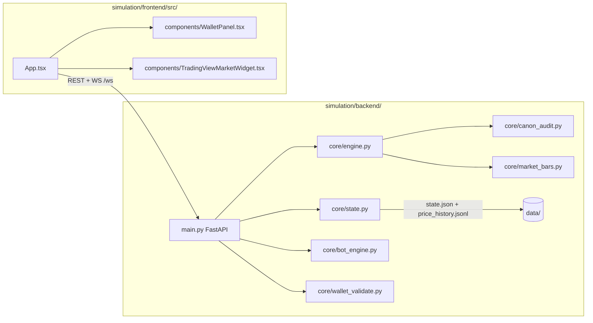
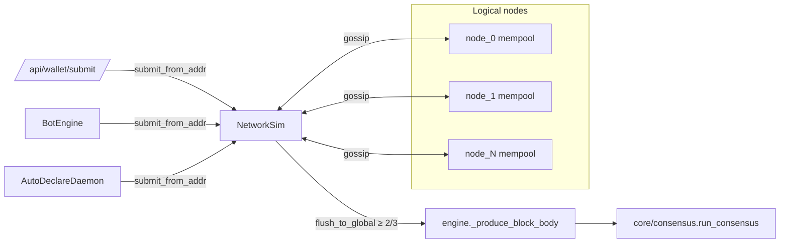

# Volnix Protocol Simulation

Off-chain симуляция (FastAPI backend + React/Vite frontend) для проектирования и
стресс-тестирования протокола Helvetia/Volnix. Не Cosmos-узел и не репозиторная
`backend/`-древо production-сервисов: это R&D-песочница, в которой механики §3.1–§6.3
из `docs/volnix_protocol.md` воспроизведены упрощённо для экспериментов.

```
simulation/
├── backend/                FastAPI + Pydantic, in-memory state + JSONL ledger
│   ├── main.py             REST + WebSocket + lifespan
│   ├── core/
│   │   ├── engine.py       SimulationEngine: BeginBlock → DeliverTx → EndBlock
│   │   ├── state.py        StateManager: accounts, mempool, orders, persistence
│   │   ├── ledger.py       append-only blocks.jsonl + canon_log.jsonl
│   │   ├── consensus.py    Tendermint-style PreVote/PreCommit + slashing
│   │   ├── bot_engine.py   bot_* кошельки + canon probes
│   │   ├── wallet_validate.py admission в мемпул (единый для wallet/operator/bot)
│   │   ├── canon_audit.py  + canon_log.py — журнал §3–§6
│   │   ├── auto_declare.py AutoDeclareDaemon (§5.4 declare для каждого валидатора)
│   │   ├── network.py      NetworkSim: per-node mempool + gossip latency/loss/quorum
│   │   ├── scenarios.py    YAML-сценарии (CLI + REST)
│   │   ├── analytics.py    KPI: Gini, velocity, burn ratio, accepted ratio
│   │   ├── exporters.py    CSV/JSONL экспорт блоков, балансов, тиков
│   │   ├── metrics.py      Prometheus /metrics (опционально)
│   │   ├── settings.py     env-конфиг (pydantic-settings, prefix VOLNIX_SIM_)
│   │   └── market_bars.py  OHLC для ECharts
│   ├── scripts/            gen_api_md.py + gen_canon_coverage.py
│   ├── tests/              pytest (164+)
│   ├── requirements.txt    runtime
│   └── requirements-dev.txt + pytest / ruff / mypy
├── scenarios/              YAML-сценарии (epoch wipe, validator coalition, slashing…)
├── docs/                   автогенерируемые API.md, CANON_COVERAGE.md, SCENARIOS.md
└── frontend/               React 19 + Vite 8 + Tailwind 4 + Recharts/ECharts
    └── src/
        ├── App.tsx
        ├── types.ts                       shared TS типы
        ├── store/sim.ts                   zustand store + чистые редьюсеры
        ├── hooks/useSimWebSocket.ts       единый WS-хук
        ├── hooks/useKpi.ts                useKpi + useScenarios
        ├── hooks/useNetwork.ts            NetworkSim: nodes / topology / runtime config
        ├── components/
        │   ├── KpiPanel.tsx               R&D KPI snapshot
        │   ├── NodesPanel.tsx             NetworkSim: узлы, кворум последнего блока, runtime config
        │   ├── ScenariosPanel.tsx         запуск YAML-сценариев
        │   ├── TxExplorerPanel.tsx        поиск по hash/адресу
        │   ├── WalletPanel.tsx
        │   └── wallet/api.ts              wallet REST + vitest
        └── config.ts                      VITE_API_URL / VITE_WS_URL
```

## Архитектура



## Локальный запуск

### Backend

```bash
cd simulation/backend
python -m venv venv && source venv/bin/activate
pip install -r requirements.txt           # runtime
pip install -r requirements-dev.txt       # +pytest/ruff/mypy
uvicorn main:app --reload --port 8000
```

OpenAPI документация (Swagger): http://localhost:8000/docs

### Frontend

```bash
cd simulation/frontend
npm install
npm run dev                               # http://localhost:5173
```

### Docker (одной командой)

```bash
cd simulation
docker compose up --build                 # back: 8000, front: 5173
```

## Скорость симуляции

1 блок = 60 сим. секунд (эталон канона). Скорость задаётся как «сим. секунд за
1 реальную» — от `1` (1:1, блок раз в 60 с) до `604800` (1 с реального времени =
1 неделя симуляции ≈ 10080 блоков/с):

```bash
curl -X POST localhost:8000/api/sim-operator/speed \
  -H 'Content-Type: application/json' -d '{"speed": 604800}'
```

UI: вкладка **Обзор** → панель «Скорость симуляции» (пресеты 1:1 … 1с=1нед +
ручной ввод). При интервале блока < 0.1 с движок переходит в batch-режим:
пачка блоков за тик 0.1 с и одна агрегированная WS-дельта на пачку; фактический
темп ограничен CPU и виден в поле `effective_speed` (`GET /`). Старый endpoint
`POST /api/sim-operator/block-time` (0.1–300 с) сохранён и пересчитывается в
скорость. Значение персистится в `state.json` (`sim_speed`).

## Env-конфигурация

Все настройки через переменные с префиксом `VOLNIX_SIM_` (см.
`simulation/backend/core/settings.py`):

| Переменная | Дефолт | Описание |
|---|---|---|
| `VOLNIX_SIM_DATA_DIR` | `data` | Каталог `state.json` и `price_history.jsonl` |
| `VOLNIX_SIM_CORS_ALLOW_ORIGINS` | `*` | CSV-список разрешённых origin, `*` = все |
| `VOLNIX_SIM_CORS_ALLOW_CREDENTIALS` | `true` | CORS credentials |
| `VOLNIX_SIM_LOG_LEVEL` | `INFO` | Уровень логирования |
| `VOLNIX_SIM_PERSIST_EVERY_N_BLOCKS` | `1` | Каждые N блоков пишем snapshot |
| `VOLNIX_SIM_SNAPSHOT_EVERY_N_BLOCKS` | `200` | Snapshot for ledger rotation |
| `VOLNIX_SIM_BLOCKS_IN_MEMORY` | `5000` | Хвост блоков в RAM |
| `VOLNIX_SIM_CANON_LOG_CAPACITY` | `400` | Кольцевой буфер canon_log |
| `VOLNIX_SIM_CANON_LOG_PERSIST` | `true` | Дописывать canon_log в JSONL |
| `VOLNIX_SIM_ENABLE_PROMETHEUS` | `true` | `GET /metrics` |
| `VOLNIX_SIM_BOT_AUTOSTART` | `true` | Запускать BotEngine из FastAPI lifespan |
| `VOLNIX_SIM_BOT_DEFAULT_INTENSITY` | `1.0` | tx/s бота на старте (если bot_autostart) |
| `VOLNIX_SIM_AUTO_DECLARE` | `true` | AutoDeclareDaemon: §5.4 declare за каждого валидатора в `consensus_validator_set` |
| `VOLNIX_SIM_NUM_NODES` | `1` | Логических узлов в NetworkSim. `1` → fastpath без gossip; ≥2 → per-node mempool + gossip-mock |
| `VOLNIX_SIM_GOSSIP_LATENCY_MS` | `100` | Базовая задержка доставки tx между узлами (мс) |
| `VOLNIX_SIM_GOSSIP_LOSS_PCT` | `0.0` | Вероятность потери tx при gossip-доставке (0..100) |
| `VOLNIX_SIM_GOSSIP_QUORUM_PCT` | `0.667` | Доля узлов, в которые tx должен попасть, прежде чем engine возьмёт его в блок |
| `VOLNIX_SIM_TARGET_VALIDATORS` | `4` | Бот / сценарии могут целиться в этот размер ValidatorSet (информативно) |

Фронт берёт endpoint-ы из `VITE_API_URL` и `VITE_WS_URL` (см.
`simulation/frontend/src/config.ts`).

## Многоузловость (NetworkSim, §6.3)

С `VOLNIX_SIM_NUM_NODES >= 2` симуляция переключается в гибридный multi-node
режим (в одном процессе, без отдельных tcp-узлов):

- каждый аккаунт детерминированно привязан к одному узлу (`hash(addr) % N`),
  genesis-адреса всегда на `node_0`;
- кошельковая / операторская / бот-tx подаётся в local mempool узла-источника;
- gossip-mock рассылает её по остальным узлам с задержкой `VOLNIX_SIM_GOSSIP_LATENCY_MS`
  и вероятностью потери `VOLNIX_SIM_GOSSIP_LOSS_PCT`;
- engine забирает в блок только те tx, что дошли до кворума ≥ `VOLNIX_SIM_GOSSIP_QUORUM_PCT`
  (по умолчанию 2/3) узлов.

Multi-round PreVote/PreCommit §6.1 включается автоматически, как только
`len(consensus_validator_set) >= 2`. Чтобы цепочка росла без ручного вмешательства,
`AutoDeclareDaemon` (env `VOLNIX_SIM_AUTO_DECLARE`) подаёт canon-корректный
declare §5.4 за каждого валидатора в каждом тике `block_time/2`.

REST/UI: `GET /api/network/nodes`, `GET /api/network/topology`, `POST /api/network/config`;
во вкладке **R&D / KPI** есть панель «Сеть» с таблицей узлов, голосов последнего
блока и runtime-конфигом latency/loss/quorum.



## Канон

- `docs/volnix_protocol.md` — каноническая спецификация.
- `docs/WHITEPAPER.md` / `docs/WHITEPAPER_RU.md` — публичные нарративы.
- Симуляция дублирует не консенсус Cosmos-узла, а экономико-протокольные правила
  §3.1 (ZKP-флаг), §4.1–4.2 (типы кошельков, активы), §5.1–5.5 (награды, рынок,
  declare/burn, эпоха ANT), §6.1/§6.3 (genesis и ValidatorSet).
- **Ruleset v2**: движок реализует поправки к канону v4.20 (только верхний предел
  `Σb_i ≤ λ·L_total`, возвращаемая ставка `s_i`, фиксированный wipe эпохи,
  стабильный коэффициент эмиссии, детерминированный tie-breaker) —
  см. `simulation/docs/V2_RULESET.md` и `docs/CANON_PROBLEMS.md`.

Покрытие — см. автогенерируемый отчёт `simulation/docs/CANON_COVERAGE.md`.

## Документация

- `simulation/docs/SCENARIOS.md` — YAML-сценарии (шаги, ассерты, CLI/REST/UI).
- `simulation/docs/API.md` — REST/WS endpoint reference (генерится из OpenAPI).
- `simulation/docs/CANON_COVERAGE.md` — покрытие §X.Y тестами и аудитом.

Авто-генерация (CI запускает оба):

```bash
cd simulation/backend
python scripts/gen_api_md.py ../docs/API.md
python scripts/gen_canon_coverage.py ../docs/CANON_COVERAGE.md
```

## KPI / Аналитика

| endpoint | данные |
|---|---|
| `GET /api/analytics/kpi` | gini, velocity, burn ratio, accepted block ratio, supply, role counts |
| `GET /api/analytics/gini?asset=wrt` | Gini по активу |
| `GET /api/export/blocks.jsonl[?from_height=&to_height=]` | append-only ledger |
| `GET /api/export/balances.csv` | срез балансов |
| `GET /api/export/ticks.csv` | OHLC-тики |
| `GET /api/export/canon_log.jsonl?limit=N` | canon-аудит |
| `GET /metrics` | Prometheus (через `prometheus_client`, опционально) |

Готовый Grafana-дашборд: `infrastructure/grafana/simulation/dashboard.json`.

## Сценарии

```bash
cd simulation/backend
python -m core.scenarios list
python -m core.scenarios run epoch_wipe_stress.yaml
```

REST: `GET /api/scenarios`, `POST /api/scenarios/run`. Подробнее — см.
`simulation/docs/SCENARIOS.md`.

## Тестирование

```bash
cd simulation/backend
pytest -v                                 # юнит + интеграция (164+ tests)
pytest --cov=core --cov-report=term-missing

cd ../frontend
npm test                                  # vitest (store / format / wallet api)
npm run lint                              # eslint
npm run build                             # tsc + vite build
```

## Roadmap

Поэтапный план развития: `.cursor/plans/simulation_roadmap_r&d_*.plan.md`
(этапы 0–6 от Quick wins до многовалидаторного консенсуса, scenario-движка,
KPI/экспорта и модуляризации фронта).

Multi-node sim revive (canon §6.3): `.cursor/plans/multi-node_sim_revive_*.plan.md`
— AutoDeclareDaemon, NetworkSim + per-node mempool/gossip, runtime config,
интеграция в lifespan, REST `/api/network/*`, NodesPanel.
